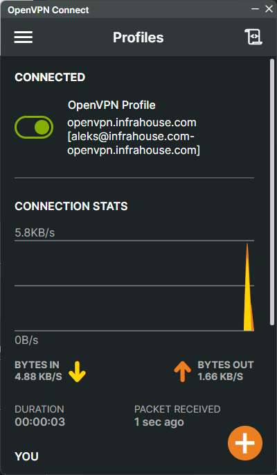

# terraform-aws-openvpn
The [openvpn module](https://registry.terraform.io/modules/infrahouse/openvpn/aws/latest) deploys an OpenVPN server 
with Google OAuth2.0 authentication.


OpenVPN Portal is a web application. It authenticates users by their Google account and generates 
an OpenVPN profile for them.

You would put the OpenVPN server in a public subnet in your AWS cloud to give access to authorized users 
to AWS resources in private subnets.

## Installation

To illustrate how to use the module, I will deploy a VPN server for InfraHouse.

### **Step 1**: Create a Terraform code.
```hcl
module "vpn" {
  source  = "registry.infrahouse.com/infrahouse/openvpn/aws"
  version = "~> 0.2"
  providers = {
    aws     = aws
    aws.dns = aws
  }
  backend_subnet_ids         = module.management.subnet_private_ids
  lb_subnet_ids              = module.management.subnet_public_ids
  google_oauth_client_writer = data.aws_iam_role.AWSAdministratorAccess.arn
  zone_id                    = module.infrahouse_com.infrahouse_zone_id
}

data "aws_iam_role" "AWSAdministratorAccess" {
  name = "AWSReservedSSO_AWSAdministratorAccess_a84a03e62f490b50"
}
```
Our VPN setup will consist of two components: OpenVPN server and OpenVPN Portal

The OpenVPN server is deployed on an autoscale group and fronted by a network load balancer.


The OpenVPN Portal is a Web application deployed as an AWS ECS service. 
It talks to Google to authenticate users and distributes OpenVPN profiles needed to configure a client application. 


All module variables here are required. Let's go over them.

* `backend_subnet_ids`. This is a list of subnet-id-s where autoscale EC2 instances will be places. 
Access to VPN is provided by a network load balancer, so we want the EC2 instances to run in private subnets.
* `lb_subnet_ids`. This is a list of subnet-id-s where the network load balancer will be running. We want it to be in  
public subnets because it is going to be a publicly accessible gateway to our private AWS resources.  
* `google_oauth_client_writer`. The OpenVPN Portal will need credentials to talk to Google, so it can authenticate users.
`google_oauth_client_writer` is an identity ARN that has a permission to update a secret with those credentials.
More on that below. In this case, I will update the secret, so the value is a role ARN I get on my laptop 
via AWS Control Tower SSO. 
* `zone_id`. The module will create two public DNS names: openvpn.infrahouse.com and openvpn-portal.infrahouse.com.
infrahouse.com is hosted in Route53 so `zone_id` is its zone identifier.
* `providers` block. In some cases, you want the VPN and DNS resources to be managed by different roles or 
deployed in different AWS account. That's why I separated two providers. 
`aws.dns` is responsible for creating Route53 resources and the default `aws` provider does the rest. In my case, 
the VPN and infrahouse.com live in the same AWS account. so the providers are the same.   

### **Step 2**: Create a pull request

This is a commit.
```
$ git log -p -1
commit b695867f71846a1e7d2fabf14e21cebd2b026516 (HEAD -> vpn)
Author: Oleksandr Kuzminskyi <aleksandr.kuzminsky@gmail.com>
Date:   Fri Jul 5 11:35:18 2024 -0700

    Deploy VPN

diff --git a/vpn.tf b/vpn.tf
new file mode 100644
index 0000000..035b925
--- /dev/null
+++ b/vpn.tf
@@ -0,0 +1,16 @@
+module "vpn" {
+  source  = "registry.infrahouse.com/infrahouse/openvpn/aws"
+  version = "~> 0.2"
+  providers = {
+    aws     = aws
+    aws.dns = aws
+  }
+  backend_subnet_ids         = module.management.subnet_private_ids
+  lb_subnet_ids              = module.management.subnet_public_ids
+  google_oauth_client_writer = data.aws_iam_role.AWSAdministratorAccess.arn
+  zone_id                    = module.infrahouse_com.infrahouse_zone_id
+}
+
+data "aws_iam_role" "AWSAdministratorAccess" {
+  name = "AWSReservedSSO_AWSAdministratorAccess_a84a03e62f490b50"
+}
```
Create the PR:
```shell
$ gh pr create
? Where should we push the 'vpn' branch? infrahouse/aws-control-493370826424

Creating pull request for vpn into main in infrahouse/aws-control-493370826424

? Title Deploy VPN
? Body <Received>
? What's next? Submit
remote:
remote:
To github.com:infrahouse/aws-control-493370826424.git
 * [new branch]      HEAD -> vpn
Branch 'vpn' set up to track remote branch 'vpn' from 'origin'.
https://github.com/infrahouse/aws-control-493370826424/pull/199
```
Now, the [pull request](https://github.com/infrahouse/aws-control-493370826424/pull/199) successfully ran `terraform plan` 
and we can review what Terraform is going to do.


Normally, the module will create about 80 resources. In my case, all of them start with a "module.vnp", 
which is a good indicator Terraform will create resources that we expect it to do.
If your plan includes resources to be changed or destroyed - double-check the STDOUT to understand what's going on.


### **Step 3**: Merge the pull request.
```shell
$ gh pr merge -ds
✓ Squashed and merged pull request #199 (Deploy VPN)
remote: Enumerating objects: 1, done.
remote: Counting objects: 100% (1/1), done.
remote: Total 1 (delta 0), reused 0 (delta 0), pack-reused 0
Unpacking objects: 100% (1/1), 849 bytes | 169.00 KiB/s, done.
From github.com:infrahouse/aws-control-493370826424
 * branch            main       -> FETCH_HEAD
   efd3d98..5f28f7a  main       -> origin/main
Updating efd3d98..5f28f7a
Fast-forward
 vpn.tf | 16 ++++++++++++++++
 1 file changed, 16 insertions(+)
 create mode 100644 vpn.tf
✓ Deleted branch vpn and switched to branch main
```
[Check](https://github.com/infrahouse/aws-control-493370826424/pull/199) that Terraform successfully created the VPN resources.


### **Step 4**: Configure Google OAuth2.0.

Now if you open https://openvpn-portal.infrahouse.com/ in a browser, you'll see a 502 error.
It's because I didn't update Google Client credentials. So, let's remedy that.


This is a Google client secret that Terraform created.
```shell
$ ih-secrets --aws-region us-west-1 --aws-profile AWSAdministratorAccess-493370826424 list | grep google
| google_client20240705183915856300000015              | A JSON with Google OAuth Client ID                                                                                        |
```
If you get its value, it will show `NoValue`:
```shell
$ ih-secrets --aws-region us-west-1 --aws-profile AWSAdministratorAccess-493370826424 get google_client20240705183915856300000015
NoValue
```
#### **Step 4.1**: Create OAuth 2.0 credentials.

Open [Google Cloud Console](https://console.cloud.google.com/) and create an OpenVPN project.


Next, go to "Credentials". 


Next, Create OAuth client ID. Note, authentication requests will come from https://openvpn-portal.infrahouse.com,
so I added it to "Authorized JavaScript origins". Another important setting is "Authorized redirect URIs".
It must be https://openvpn-portal.infrahouse.com/login/google/authorized. For your domain it will be something like
https://openvpn-portal.my-domain.com/login/google/authorized.


#### **Step 4.2**: Download OAuth 2.0 credentials.

After you press a create button, you'll see a confirmation screen with a DOWNLOAD JSON link. 
Click it and save the file.


#### **Step 4.3**: Update Google OAuth Client ID secret value.

From a previous I know the secret name is `google_client20240705183915856300000015`. Let's update it 
with a valid value.

As a reference, the value should look like this
```shell
$ jq < client_secret.json
{
  "web": {
    "client_id": "145076599640-incpb6lilkj5duv3qs65n6f9r5avo482.apps.googleusercontent.com",
    "project_id": "openvpn-427715",
    "auth_uri": "https://accounts.google.com/o/oauth2/auth",
    "token_uri": "https://oauth2.googleapis.com/token",
    "auth_provider_x509_cert_url": "https://www.googleapis.com/oauth2/v1/certs",
    "client_secret": "very-secret-string",
    "redirect_uris": [
      "https://openvpn-portal.infrahouse.com/login/google/authorized"
    ],
    "javascript_origins": [
      "https://openvpn-portal.infrahouse.com"
    ]
  }
}
```

```shell
$ ih-secrets \
  --aws-region us-west-1 \
  --aws-profile AWSAdministratorAccess-493370826424 \
  set \
  google_client20240705183915856300000015 \
  client_secret.json
```

### **Step 5**: Check on OpenVPN Portal.
After a short time, the portal should pick up the new and value Google Client ID value. 
When you open https://openvpn-portal.infrahouse.com/ again, it will present a Google login window. 

After a successful authentication, the portal will show a page with OpenVPN client instructions.


### **Step 6**: Install OpenVPN client.

The portal has links to an installer for MacOS and Windows. For other OS-es you can go to https://openvpn.net/client/
and download the client from there.


### **Step 6**: Download and import OpenVPN profile.

Once the client is installed, click on https://openvpn-portal.infrahouse.com/profile and save the OpenVPN profile 
on your laptop.

Double-click on the `aleks@infrahouse.com-openvpn.infrahouse.com.ovpn` file. It will open the client and suggest 
to import the profile.


### **Step 7**: Connect to VPN.

| Original Image                            |    | Transformed Image                            |
|-------------------------------------------|----|----------------------------------------------|
|        | ➡️ |                |


### **Step 8**: Check network connectivity with the VPN server.

The VPN server has address 172.16.0.1. Let's make sure it's reachable via the VPN.

```shell
$ ping -c 3 172.16.0.1
PING 172.16.0.1 (172.16.0.1) 56(84) bytes of data.
64 bytes from 172.16.0.1: icmp_seq=1 ttl=63 time=9.84 ms
64 bytes from 172.16.0.1: icmp_seq=2 ttl=63 time=12.8 ms
64 bytes from 172.16.0.1: icmp_seq=3 ttl=63 time=11.3 ms

--- 172.16.0.1 ping statistics ---
3 packets transmitted, 3 received, 0% packet loss, time 2003ms
rtt min/avg/max/mdev = 9.844/11.312/12.833/1.220 ms
```
However, if we try to ping the primary interface on the OpenVPN server, it's unreachable. 

```shell
$ ih-ec2 --aws-region us-west-1 --aws-profile AWSAdministratorAccess-493370826424 list
2024-07-05 12:37:23,046: INFO: botocore.tokens:tokens._refresher():305: Loading cached SSO token for infrahouse
2024-07-05 12:37:23,656: INFO: infrahouse_toolkit.cli.ih_ec2:__init__.ih_ec2():68: Connected to AWS as arn:aws:sts::493370826424:assumed-role/AWSReservedSSO_AWSAdministratorAccess_a84a03e62f490b50/aleks
2024-07-05 12:37:23,714: INFO: botocore.tokens:tokens._refresher():305: Loading cached SSO token for infrahouse
+--------------------+---------------------+----------------+-----------------+-------------------+--------------------+---------+
| Name               | InstanceId          | InstanceType   | PublicDnsName   | PublicIpAddress   | PrivateIpAddress   | State   |
+====================+=====================+================+=================+===================+====================+=========+
...
| openvpn            | i-009c6fb01374dfa9e | m6in.large     |                 |                   | 10.0.1.244         | running |
| openvpn-portal     | i-057151311f6ee0621 | t3.small       |                 |                   | 10.0.1.104         | running |
+--------------------+---------------------+----------------+-----------------+-------------------+--------------------+---------+
```

```shell
$ ping -c 3 10.0.1.244
PING 10.0.1.244 (10.0.1.244) 56(84) bytes of data.

--- 10.0.1.244 ping statistics ---
3 packets transmitted, 0 received, 100% packet loss, time 2092ms
```

It's because we didn't let the VPN client what networks are accessible via the VPN tunnel.


### **Step 9**: Add routes to the VPN client.

I want to make the management VPN in the InfraHouse cloud to be available to the VPN clients. To do that, let's 
amend the module configuration.

```shell
$ git log -p -1
commit d3c4f50dd8d427ab25ba30cadccd328bc1def7d3 (HEAD -> vpn, origin/vpn)
Author: Oleksandr Kuzminskyi <aleksandr.kuzminsky@gmail.com>
Date:   Fri Jul 5 12:32:00 2024 -0700

    Add VPN routes

diff --git a/vpn.tf b/vpn.tf
index 035b925..83fe71f 100644
--- a/vpn.tf
+++ b/vpn.tf
@@ -9,6 +9,12 @@ module "vpn" {
   lb_subnet_ids              = module.management.subnet_public_ids
   google_oauth_client_writer = data.aws_iam_role.AWSAdministratorAccess.arn
   zone_id                    = module.infrahouse_com.infrahouse_zone_id
+  routes = [
+    {
+      network : cidrhost(module.management.vpc_cidr_block, 0)
+      netmask : cidrnetmask(module.management.vpc_cidr_block)
+    }
+  ]
 }

 data "aws_iam_role" "AWSAdministratorAccess" {
```

Create a [pull request](https://github.com/infrahouse/aws-control-493370826424/pull/200), get it merged,
and make sure it's successfully applied.

### **Step 10**: Check network availability of instances beyond the VPN server.

When the Terraform change is applied, the OpenVPN autoscaling group triggers in instance refresh. 
It takes at least 5 to 10 minutes to rotate the instances. The openVPN client will reconnect when the server changes.
Wait until it happens and check if you can ping private IP addresses of instances in your VPC.

```shell
$ ih-ec2 --aws-region us-west-1 --aws-profile AWSAdministratorAccess-493370826424 list | grep openvpn
| openvpn            | i-04933b6fb1a9ae7c8 | m6in.large     |                 |                   |                    | terminated |
| openvpn            | i-08705597ae7457604 | m6in.large     |                 |                   |                    | terminated |
| openvpn            | i-00ecc4e72166d9ef0 | m6in.large     |                 |                   | 10.0.3.144         | running    |
| openvpn            | i-009c6fb01374dfa9e | m6in.large     |                 |                   |                    | terminated |
| openvpn            | i-082016a9399b155f6 | m6in.large     |                 |                   | 10.0.1.245         | running    |
| openvpn-portal     | i-057151311f6ee0621 | t3.small       |                 |                   | 10.0.1.104         | running    |
```

```shell
$ ping  -c 1 10.0.3.144
PING 10.0.3.144 (10.0.3.144) 56(84) bytes of data.
64 bytes from 10.0.3.144: icmp_seq=1 ttl=62 time=63.1 ms

--- 10.0.3.144 ping statistics ---
1 packets transmitted, 1 received, 0% packet loss, time 0ms
rtt min/avg/max/mdev = 63.058/63.058/63.058/0.000 ms
```

```shell
$ ping  -c 1 10.0.1.104
PING 10.0.1.104 (10.0.1.104) 56(84) bytes of data.
64 bytes from 10.0.1.104: icmp_seq=1 ttl=253 time=7.29 ms

--- 10.0.1.104 ping statistics ---
1 packets transmitted, 1 received, 0% packet loss, time 0ms
rtt min/avg/max/mdev = 7.285/7.285/7.285/0.000 ms
```
## Requirements

| Name | Version |
|------|---------|
| <a name="requirement_terraform"></a> [terraform](#requirement\_terraform) | ~> 1.5 |
| <a name="requirement_aws"></a> [aws](#requirement\_aws) | ~> 5.11 |
| <a name="requirement_cloudinit"></a> [cloudinit](#requirement\_cloudinit) | ~> 2.3 |
| <a name="requirement_null"></a> [null](#requirement\_null) | ~> 3.2 |
| <a name="requirement_random"></a> [random](#requirement\_random) | ~> 3.6 |
| <a name="requirement_tls"></a> [tls](#requirement\_tls) | ~> 4.0 |

## Providers

| Name | Version |
|------|---------|
| <a name="provider_aws"></a> [aws](#provider\_aws) | ~> 5.11 |
| <a name="provider_aws.dns"></a> [aws.dns](#provider\_aws.dns) | ~> 5.11 |
| <a name="provider_random"></a> [random](#provider\_random) | ~> 3.6 |
| <a name="provider_tls"></a> [tls](#provider\_tls) | ~> 4.0 |

## Modules

| Name | Source | Version |
|------|--------|---------|
| <a name="module_ca_passkey"></a> [ca\_passkey](#module\_ca\_passkey) | registry.infrahouse.com/infrahouse/secret/aws | 0.5.0 |
| <a name="module_flask_secret_key"></a> [flask\_secret\_key](#module\_flask\_secret\_key) | registry.infrahouse.com/infrahouse/secret/aws | 0.5.0 |
| <a name="module_google_client"></a> [google\_client](#module\_google\_client) | infrahouse/secret/aws | 0.5.0 |
| <a name="module_instance_profile"></a> [instance\_profile](#module\_instance\_profile) | registry.infrahouse.com/infrahouse/instance-profile/aws | 1.4.0 |
| <a name="module_openvpn-portal"></a> [openvpn-portal](#module\_openvpn-portal) | registry.infrahouse.com/infrahouse/ecs/aws | 3.2.0 |
| <a name="module_userdata"></a> [userdata](#module\_userdata) | registry.infrahouse.com/infrahouse/cloud-init/aws | 1.12.4 |

## Resources

| Name | Type |
|------|------|
| [aws_autoscaling_group.openvpn](https://registry.terraform.io/providers/hashicorp/aws/latest/docs/resources/autoscaling_group) | resource |
| [aws_efs_file_system.openvpn-config](https://registry.terraform.io/providers/hashicorp/aws/latest/docs/resources/efs_file_system) | resource |
| [aws_efs_mount_target.openvpn-config](https://registry.terraform.io/providers/hashicorp/aws/latest/docs/resources/efs_mount_target) | resource |
| [aws_iam_policy.openvpn_portal_role](https://registry.terraform.io/providers/hashicorp/aws/latest/docs/resources/iam_policy) | resource |
| [aws_iam_role.openvpn_portal_role](https://registry.terraform.io/providers/hashicorp/aws/latest/docs/resources/iam_role) | resource |
| [aws_iam_role_policy_attachment.task_role](https://registry.terraform.io/providers/hashicorp/aws/latest/docs/resources/iam_role_policy_attachment) | resource |
| [aws_key_pair.deployer](https://registry.terraform.io/providers/hashicorp/aws/latest/docs/resources/key_pair) | resource |
| [aws_launch_template.openvpn](https://registry.terraform.io/providers/hashicorp/aws/latest/docs/resources/launch_template) | resource |
| [aws_lb.openvpn](https://registry.terraform.io/providers/hashicorp/aws/latest/docs/resources/lb) | resource |
| [aws_lb_listener.openvpn](https://registry.terraform.io/providers/hashicorp/aws/latest/docs/resources/lb_listener) | resource |
| [aws_lb_target_group.openvpn](https://registry.terraform.io/providers/hashicorp/aws/latest/docs/resources/lb_target_group) | resource |
| [aws_route53_record.vpn_cname](https://registry.terraform.io/providers/hashicorp/aws/latest/docs/resources/route53_record) | resource |
| [aws_security_group.efs](https://registry.terraform.io/providers/hashicorp/aws/latest/docs/resources/security_group) | resource |
| [aws_security_group.openvpn](https://registry.terraform.io/providers/hashicorp/aws/latest/docs/resources/security_group) | resource |
| [aws_vpc_security_group_egress_rule.default](https://registry.terraform.io/providers/hashicorp/aws/latest/docs/resources/vpc_security_group_egress_rule) | resource |
| [aws_vpc_security_group_egress_rule.efs](https://registry.terraform.io/providers/hashicorp/aws/latest/docs/resources/vpc_security_group_egress_rule) | resource |
| [aws_vpc_security_group_ingress_rule.efs](https://registry.terraform.io/providers/hashicorp/aws/latest/docs/resources/vpc_security_group_ingress_rule) | resource |
| [aws_vpc_security_group_ingress_rule.efs_icmp](https://registry.terraform.io/providers/hashicorp/aws/latest/docs/resources/vpc_security_group_ingress_rule) | resource |
| [aws_vpc_security_group_ingress_rule.icmp](https://registry.terraform.io/providers/hashicorp/aws/latest/docs/resources/vpc_security_group_ingress_rule) | resource |
| [aws_vpc_security_group_ingress_rule.openvpn](https://registry.terraform.io/providers/hashicorp/aws/latest/docs/resources/vpc_security_group_ingress_rule) | resource |
| [aws_vpc_security_group_ingress_rule.ssh](https://registry.terraform.io/providers/hashicorp/aws/latest/docs/resources/vpc_security_group_ingress_rule) | resource |
| [random_password.ca_passkey](https://registry.terraform.io/providers/hashicorp/random/latest/docs/resources/password) | resource |
| [random_password.flask_secret_key](https://registry.terraform.io/providers/hashicorp/random/latest/docs/resources/password) | resource |
| [random_string.asg_name](https://registry.terraform.io/providers/hashicorp/random/latest/docs/resources/string) | resource |
| [random_string.profile-suffix](https://registry.terraform.io/providers/hashicorp/random/latest/docs/resources/string) | resource |
| [random_string.role-suffix](https://registry.terraform.io/providers/hashicorp/random/latest/docs/resources/string) | resource |
| [tls_private_key.rsa](https://registry.terraform.io/providers/hashicorp/tls/latest/docs/resources/private_key) | resource |
| [aws_ami.selected](https://registry.terraform.io/providers/hashicorp/aws/latest/docs/data-sources/ami) | data source |
| [aws_ami.ubuntu](https://registry.terraform.io/providers/hashicorp/aws/latest/docs/data-sources/ami) | data source |
| [aws_availability_zones.available](https://registry.terraform.io/providers/hashicorp/aws/latest/docs/data-sources/availability_zones) | data source |
| [aws_caller_identity.current](https://registry.terraform.io/providers/hashicorp/aws/latest/docs/data-sources/caller_identity) | data source |
| [aws_iam_policy_document.instance_permissions](https://registry.terraform.io/providers/hashicorp/aws/latest/docs/data-sources/iam_policy_document) | data source |
| [aws_iam_policy_document.openvpn_portal_role_assume](https://registry.terraform.io/providers/hashicorp/aws/latest/docs/data-sources/iam_policy_document) | data source |
| [aws_iam_policy_document.openvpn_portal_role_permissions](https://registry.terraform.io/providers/hashicorp/aws/latest/docs/data-sources/iam_policy_document) | data source |
| [aws_internet_gateway.current](https://registry.terraform.io/providers/hashicorp/aws/latest/docs/data-sources/internet_gateway) | data source |
| [aws_region.current](https://registry.terraform.io/providers/hashicorp/aws/latest/docs/data-sources/region) | data source |
| [aws_route53_zone.current](https://registry.terraform.io/providers/hashicorp/aws/latest/docs/data-sources/route53_zone) | data source |
| [aws_subnet.selected](https://registry.terraform.io/providers/hashicorp/aws/latest/docs/data-sources/subnet) | data source |
| [aws_vpc.selected](https://registry.terraform.io/providers/hashicorp/aws/latest/docs/data-sources/vpc) | data source |

## Inputs

| Name | Description | Type | Default | Required |
|------|-------------|------|---------|:--------:|
| <a name="input_alb_access_log_force_destroy"></a> [alb\_access\_log\_force\_destroy](#input\_alb\_access\_log\_force\_destroy) | Destroy S3 bucket with access logs even if non-empty | `bool` | `false` | no |
| <a name="input_asg_ami"></a> [asg\_ami](#input\_asg\_ami) | Image for EC2 instances | `string` | `null` | no |
| <a name="input_asg_health_check_grace_period"></a> [asg\_health\_check\_grace\_period](#input\_asg\_health\_check\_grace\_period) | ASG will wait up to this number of minutes for instance to become healthy | `number` | `600` | no |
| <a name="input_asg_max_size"></a> [asg\_max\_size](#input\_asg\_max\_size) | Maximum number of instances in ASG | `number` | `null` | no |
| <a name="input_asg_min_size"></a> [asg\_min\_size](#input\_asg\_min\_size) | Minimum number of instances in ASG | `number` | `null` | no |
| <a name="input_backend_subnet_ids"></a> [backend\_subnet\_ids](#input\_backend\_subnet\_ids) | List of subnet ids where the webserver and database instances will be created | `list(string)` | n/a | yes |
| <a name="input_environment"></a> [environment](#input\_environment) | Name of environment. | `string` | `"development"` | no |
| <a name="input_extra_files"></a> [extra\_files](#input\_extra\_files) | Additional files to create on an instance. | <pre>list(object({<br>    content     = string<br>    path        = string<br>    permissions = string<br>  }))</pre> | `[]` | no |
| <a name="input_extra_policies"></a> [extra\_policies](#input\_extra\_policies) | A map of additional policy ARNs to attach to the jumphost role | `map(string)` | `{}` | no |
| <a name="input_extra_repos"></a> [extra\_repos](#input\_extra\_repos) | Additional APT repositories to configure on an instance. | <pre>map(<br>    object(<br>      {<br>        source = string<br>        key    = string<br>      }<br>    )<br>  )</pre> | `{}` | no |
| <a name="input_google_oauth_client_writer"></a> [google\_oauth\_client\_writer](#input\_google\_oauth\_client\_writer) | ARN of an IAM role that can update content of google\_oauth\_client secret | `string` | n/a | yes |
| <a name="input_instance_type"></a> [instance\_type](#input\_instance\_type) | Instance type to run the OpenVPN instances | `string` | `"m6in.large"` | no |
| <a name="input_key_pair_name"></a> [key\_pair\_name](#input\_key\_pair\_name) | SSH keypair name to be deployed in EC2 instances | `string` | `null` | no |
| <a name="input_lb_subnet_ids"></a> [lb\_subnet\_ids](#input\_lb\_subnet\_ids) | List of subnet ids where the load balancer will be created | `list(string)` | n/a | yes |
| <a name="input_packages"></a> [packages](#input\_packages) | List of packages to install when the instances bootstraps. | `list(string)` | `[]` | no |
| <a name="input_portal-image"></a> [portal-image](#input\_portal-image) | OpenVPN portal docker image | `string` | `"public.ecr.aws/infrahouse/openvpn-portal:latest"` | no |
| <a name="input_portal_instance_type"></a> [portal\_instance\_type](#input\_portal\_instance\_type) | AWS instance type for the portal service | `string` | `"t3.small"` | no |
| <a name="input_portal_workers_count"></a> [portal\_workers\_count](#input\_portal\_workers\_count) | Number of unicorn workers in OpenVPN portal | `number` | `4` | no |
| <a name="input_puppet_custom_facts"></a> [puppet\_custom\_facts](#input\_puppet\_custom\_facts) | A map of custom puppet facts | `any` | `{}` | no |
| <a name="input_puppet_debug_logging"></a> [puppet\_debug\_logging](#input\_puppet\_debug\_logging) | Enable debug logging if true. | `bool` | `false` | no |
| <a name="input_puppet_environmentpath"></a> [puppet\_environmentpath](#input\_puppet\_environmentpath) | A path for directory environments. | `string` | `"{root_directory}/environments"` | no |
| <a name="input_puppet_hiera_config_path"></a> [puppet\_hiera\_config\_path](#input\_puppet\_hiera\_config\_path) | Path to hiera configuration file. | `string` | `"{root_directory}/environments/{environment}/hiera.yaml"` | no |
| <a name="input_puppet_manifest"></a> [puppet\_manifest](#input\_puppet\_manifest) | Path to puppet manifest. By default ih-puppet will apply {root\_directory}/environments/{environment}/manifests/site.pp. | `string` | `null` | no |
| <a name="input_puppet_module_path"></a> [puppet\_module\_path](#input\_puppet\_module\_path) | Path to common puppet modules. | `string` | `"{root_directory}/modules"` | no |
| <a name="input_puppet_root_directory"></a> [puppet\_root\_directory](#input\_puppet\_root\_directory) | Path where the puppet code is hosted. | `string` | `"/opt/puppet-code"` | no |
| <a name="input_root_volume_size"></a> [root\_volume\_size](#input\_root\_volume\_size) | Root volume size in EC2 instance in Gigabytes | `number` | `30` | no |
| <a name="input_routes"></a> [routes](#input\_routes) | List of network/netmasks in format 10.x.x.x/255.x.x.x that need to be pushed to a client. [{network: "10.0.0.0", netmask: "255.0.0.0"}] | <pre>list(<br>    object(<br>      {<br>        network : string,<br>        netmask : string<br>      }<br>    )<br>  )</pre> | `[]` | no |
| <a name="input_service_name"></a> [service\_name](#input\_service\_name) | DNS hostname for the service. It's also used to name some resources like EC2 instances. | `string` | `"openvpn"` | no |
| <a name="input_smtp_credentials_secret"></a> [smtp\_credentials\_secret](#input\_smtp\_credentials\_secret) | AWS secret name with SMTP credentials. The secret must contain a JSON with user and password keys. | `string` | `null` | no |
| <a name="input_ubuntu_codename"></a> [ubuntu\_codename](#input\_ubuntu\_codename) | Ubuntu version to use for the elasticsearch node | `string` | `"jammy"` | no |
| <a name="input_zone_id"></a> [zone\_id](#input\_zone\_id) | Domain name zone ID where the website will be available | `string` | n/a | yes |

## Outputs

| Name | Description |
|------|-------------|
| <a name="output_google_client_secret"></a> [google\_client\_secret](#output\_google\_client\_secret) | google\_client secret name. OpenVPN portal admin must update the secret with a Google OAuth client JSON. |
