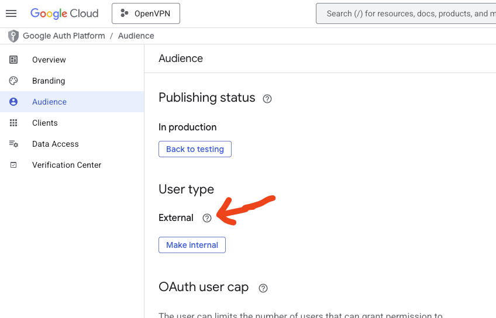
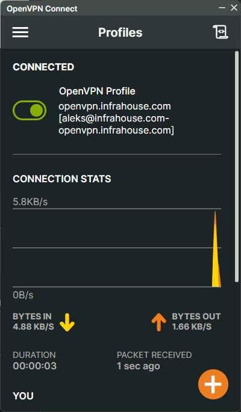

# terraform-aws-openvpn

The [openvpn module](https://registry.terraform.io/modules/infrahouse/openvpn/aws/latest) deploys 
an OpenVPN server with Google OAuth 2.0 authentication.

Starting with version 4.0.0, the module supports VPN users from multiple Google domains.


The OpenVPN Portal is a web application that authenticates users via their Google accounts 
and generates an OpenVPN profile for them.

You should place the OpenVPN server in public subnets in your AWS environment 
so authorized users can access resources in private subnets.

## Installation

To illustrate how to use the module, we will deploy a VPN server for InfraHouse.

### **Step 1**: Create Terraform configuration

```hcl
module "vpn" {
  source  = "registry.infrahouse.com/infrahouse/openvpn/aws"
  version = "5.3.0"

  providers = {
    aws     = aws
    aws.dns = aws
  }

  backend_subnet_ids         = module.management.subnet_private_ids
  lb_subnet_ids              = module.management.subnet_public_ids
  google_oauth_client_writer = tolist(data.aws_iam_roles.sso-admin.arns)[0]
  zone_id                    = module.infrahouse_com.infrahouse_zone_id
  allowed_domains            = [
    # "infrahouse.com",  <- implicitly derived from module.infrahouse_com.infrahouse_zone_id
    "foo.com"
  ]
}

data "aws_iam_roles" "sso-admin" {
  name_regex  = "AWSReservedSSO_AWSAdministratorAccess_.*"
  path_prefix = "/aws-reserved/sso.amazonaws.com/"
}
```
Our VPN setup will consist of two components: the OpenVPN server and the OpenVPN Portal.

OpenVPN server: Deployed in an Auto Scaling group fronted by a Network Load Balancer.


OpenVPN Portal: A web application deployed as an AWS ECS service. 
It authenticates users via Google and distributes OpenVPN profiles.


All module variables shown above are required, except `allowed_domains`:

* `backend_subnet_ids`. A list of subnet IDs for the EC2 instances in the Auto Scaling group (private subnets).
* `lb_subnet_ids`. A list of subnet IDs for the Network Load Balancer (public subnets).  
* `google_oauth_client_writer`. The IAM role ARN permitted to update the Google OAuth client secret.
* `zone_id`. The Route 53 zone ID (e.g., infrahouse.com) for DNS records.
* `providers` Separate providers for AWS and Route 53 (`aws.dns`). 
`aws.dns` is responsible for creating Route53 resources and the default `aws` provider does the rest. In our case, 
the VPN and infrahouse.com live in the same AWS account. so the providers are the same.
* `allowed_domains` (optional). A list of domain names whose users are permitted to connect to the VPN server. 
The module will automatically include the domain specified by `zone_id`.

### **Step 2**: Create a pull request

This is a commit.
```
$ git log -p -1
commit b695867f71846a1e7d2fabf14e21cebd2b026516 (HEAD -> vpn)
Author: Oleksandr Kuzminskyi <aleksandr.kuzminsky@gmail.com>
Date:   Fri Jul 5 11:35:18 2024 -0700

    Deploy VPN

diff --git a/vpn.tf b/vpn.tf
new file mode 100644
index 0000000..035b925
--- /dev/null
+++ b/vpn.tf
@@ -0,0 +1,16 @@
+module "vpn" {
+  source  = "registry.infrahouse.com/infrahouse/openvpn/aws"
+  version = "5.3.0"
+  providers = {
+    aws     = aws
+    aws.dns = aws
+  }
+  backend_subnet_ids         = module.management.subnet_private_ids
+  lb_subnet_ids              = module.management.subnet_public_ids
+  google_oauth_client_writer = data.aws_iam_role.AWSAdministratorAccess.arn
+  zone_id                    = module.infrahouse_com.infrahouse_zone_id
+}
+
+data "aws_iam_role" "AWSAdministratorAccess" {
+  name = "AWSReservedSSO_AWSAdministratorAccess_a84a03e62f490b50"
+}
```
Create the PR:
```shell
$ gh pr create
? Where should we push the 'vpn' branch? infrahouse/aws-control-493370826424

Creating pull request for vpn into main in infrahouse/aws-control-493370826424

? Title Deploy VPN
? Body <Received>
? What's next? Submit
remote:
remote:
To github.com:infrahouse/aws-control-493370826424.git
 * [new branch]      HEAD -> vpn
Branch 'vpn' set up to track remote branch 'vpn' from 'origin'.
https://github.com/infrahouse/aws-control-493370826424/pull/199
```
Now, the [pull request](https://github.com/infrahouse/aws-control-493370826424/pull/199) successfully ran `terraform plan` 
and we can review the plan output to ensure no unexpected changes.


By default, the module provisions around 80 resources. 
In your deployment, each resource address should be prefixed with `module.vpn`, 
confirming that Terraform will create the expected resources. 
If your plan shows any resources to be changed or destroyed, 
review the output carefully to understand the proposed actions before applying.


### **Step 3**: Merge the pull request.
```shell
$ gh pr merge -ds
✓ Squashed and merged pull request #199 (Deploy VPN)
remote: Enumerating objects: 1, done.
remote: Counting objects: 100% (1/1), done.
remote: Total 1 (delta 0), reused 0 (delta 0), pack-reused 0
Unpacking objects: 100% (1/1), 849 bytes | 169.00 KiB/s, done.
From github.com:infrahouse/aws-control-493370826424
 * branch            main       -> FETCH_HEAD
   efd3d98..5f28f7a  main       -> origin/main
Updating efd3d98..5f28f7a
Fast-forward
 vpn.tf | 16 ++++++++++++++++
 1 file changed, 16 insertions(+)
 create mode 100644 vpn.tf
✓ Deleted branch vpn and switched to branch main
```
[Check](https://github.com/infrahouse/aws-control-493370826424/pull/199) that Terraform successfully created the VPN resources.


### **Step 4**: Configure Google OAuth2.0.

If you visit https://openvpn-portal.infrahouse.com/ in your browser, 
you’ll get a 502 error because the Google OAuth client credentials haven’t been set yet. 
Let’s fix that now.


The module automatically creates a placeholder secret for the Google OAuth client ID. 
You can confirm this by listing secrets:

```shell
$ ih-secrets --aws-region us-west-1 --aws-profile AWSAdministratorAccess-493370826424 list | grep google
| google_client20240705183915856300000015              | A JSON with Google OAuth Client ID                                                                                        |
```

Since it’s just a placeholder, the secret has no value yet. Retrieving it returns `NoValue`:

```shell
$ ih-secrets --aws-region us-west-1 --aws-profile AWSAdministratorAccess-493370826424 get google_client20240705183915856300000015
NoValue
```
#### **Step 4.1**: Create OAuth 2.0 credentials.

Open the [Google Cloud Console](https://console.cloud.google.com/) and select (or create) your OpenVPN project.


In the sidebar, go to **APIs & Services > Credentials**.


Click **Create credentials > OAuth client ID**. Then configure:
* *Authorized JavaScript origins*: https://openvpn-portal.infrahouse.com
* *Authorized redirect URIs*: https://openvpn-portal.infrahouse.com/login/google/authorized 
(For your own domain, replace infrahouse.com with my-domain.com.)


#### **Step 4.2**: Download OAuth 2.0 credentials.

After clicking **Create**, a confirmation screen will appear with a **Download JSON** link—click 
it to download and save your credentials file.


#### **Step 4.3**: Update Google OAuth Client ID secret value.

From the previous step, the secret name is `google_client20240705183915856300000015`. 
Let’s populate it with your actual credentials. For reference, the JSON should look like this:
```shell
$ jq < client_secret.json
{
  "web": {
    "client_id": "145076599640-incpb6lilkj5duv3qs65n6f9r5avo482.apps.googleusercontent.com",
    "project_id": "openvpn-427715",
    "auth_uri": "https://accounts.google.com/o/oauth2/auth",
    "token_uri": "https://oauth2.googleapis.com/token",
    "auth_provider_x509_cert_url": "https://www.googleapis.com/oauth2/v1/certs",
    "client_secret": "very-secret-string",
    "redirect_uris": [
      "https://openvpn-portal.infrahouse.com/login/google/authorized"
    ],
    "javascript_origins": [
      "https://openvpn-portal.infrahouse.com"
    ]
  }
}
```

```shell
$ ih-secrets \
  --aws-region us-west-1 \
  --aws-profile AWSAdministratorAccess-493370826424 \
  set \
  google_client20240705183915856300000015 \
  client_secret.json
```
#### **Step 4.4**: (Optional) Enable access to VPN from multiple domains.

If you plan to support VPN users from more than one domain, you need to make the OpenVPN App external.
To do that, click on *APIs & Services > OAuth consent screen > Audience* and publish the OpenVPN App.


### **Step 5**: Check on OpenVPN Portal.

After a few moments, the portal will pick up the updated Google OAuth credentials. 
When you revisit https://openvpn-portal.infrahouse.com/, you’ll see the Google sign-in prompt. 
Once authenticated, the portal will display instructions for your OpenVPN client.


### **Step 6**: Install OpenVPN client.

The portal provides installers for macOS and Windows. 
For other operating systems, visit https://openvpn.net/client/ to download the appropriate OpenVPN client.


### **Step 6**: Download and import OpenVPN profile.

Once the client is installed, click on https://openvpn-portal.infrahouse.com/profile and save the OpenVPN profile 
on your laptop.

Double-click on the `aleks@infrahouse.com-openvpn.infrahouse.com.ovpn` file. It will open the client and suggest 
to import the profile.


### **Step 7**: Connect to VPN.

|                                                                                                             |    |                                |                            
|-------------------------------------------------------------------------------------------------------------|----|--------------------------------|
|  | ➡️ |  |


### **Step 8**: Check network connectivity with the VPN server.

The VPN server has address 172.16.0.1. Let's make sure it's reachable via the VPN.

```shell
$ ping -c 3 172.16.0.1
PING 172.16.0.1 (172.16.0.1) 56(84) bytes of data.
64 bytes from 172.16.0.1: icmp_seq=1 ttl=63 time=9.84 ms
64 bytes from 172.16.0.1: icmp_seq=2 ttl=63 time=12.8 ms
64 bytes from 172.16.0.1: icmp_seq=3 ttl=63 time=11.3 ms

--- 172.16.0.1 ping statistics ---
3 packets transmitted, 3 received, 0% packet loss, time 2003ms
rtt min/avg/max/mdev = 9.844/11.312/12.833/1.220 ms
```
However, if we try to ping the primary interface on the OpenVPN server, it's unreachable. 

```shell
$ ih-ec2 --aws-region us-west-1 --aws-profile AWSAdministratorAccess-493370826424 list
2024-07-05 12:37:23,046: INFO: botocore.tokens:tokens._refresher():305: Loading cached SSO token for infrahouse
2024-07-05 12:37:23,656: INFO: infrahouse_toolkit.cli.ih_ec2:__init__.ih_ec2():68: Connected to AWS as arn:aws:sts::493370826424:assumed-role/AWSReservedSSO_AWSAdministratorAccess_a84a03e62f490b50/aleks
2024-07-05 12:37:23,714: INFO: botocore.tokens:tokens._refresher():305: Loading cached SSO token for infrahouse
+--------------------+---------------------+----------------+-----------------+-------------------+--------------------+---------+
| Name               | InstanceId          | InstanceType   | PublicDnsName   | PublicIpAddress   | PrivateIpAddress   | State   |
+====================+=====================+================+=================+===================+====================+=========+
...
| openvpn            | i-009c6fb01374dfa9e | m6in.large     |                 |                   | 10.0.1.244         | running |
| openvpn-portal     | i-057151311f6ee0621 | t3.small       |                 |                   | 10.0.1.104         | running |
+--------------------+---------------------+----------------+-----------------+-------------------+--------------------+---------+
```

```shell
$ ping -c 3 10.0.1.244
PING 10.0.1.244 (10.0.1.244) 56(84) bytes of data.

--- 10.0.1.244 ping statistics ---
3 packets transmitted, 0 received, 100% packet loss, time 2092ms
```

This happens because we haven’t told the VPN client which networks it should route through the tunnel.


### **Step 9**: Add routes to the VPN client.

To allow VPN clients to reach the InfraHouse cloud management network, 
let’s update the module configuration.
```shell
$ git log -p -1
commit d3c4f50dd8d427ab25ba30cadccd328bc1def7d3 (HEAD -> vpn, origin/vpn)
Author: Oleksandr Kuzminskyi <aleksandr.kuzminsky@gmail.com>
Date:   Fri Jul 5 12:32:00 2024 -0700

    Add VPN routes

diff --git a/vpn.tf b/vpn.tf
index 035b925..83fe71f 100644
--- a/vpn.tf
+++ b/vpn.tf
@@ -9,6 +9,12 @@ module "vpn" {
   lb_subnet_ids              = module.management.subnet_public_ids
   google_oauth_client_writer = data.aws_iam_role.AWSAdministratorAccess.arn
   zone_id                    = module.infrahouse_com.infrahouse_zone_id
+  routes = [
+    {
+      network : cidrhost(module.management.vpc_cidr_block, 0)
+      netmask : cidrnetmask(module.management.vpc_cidr_block)
+    }
+  ]
 }

 data "aws_iam_role" "AWSAdministratorAccess" {
```

Create a [pull request](https://github.com/infrahouse/aws-control-493370826424/pull/200), get it merged,
and make sure it's successfully applied.

### **Step 10**: Check network availability of instances beyond the VPN server.

Applying the Terraform changes triggers an Auto Scaling instance refresh for the OpenVPN servers, 
which can take 5–10 minutes. The OpenVPN client will automatically reconnect 
to the new instances once they’re ready. After that, verify connectivity 
by pinging the private IP addresses in your VPC.

```shell
$ ih-ec2 --aws-region us-west-1 --aws-profile AWSAdministratorAccess-493370826424 list | grep openvpn
| openvpn            | i-04933b6fb1a9ae7c8 | m6in.large     |                 |                   |                    | terminated |
| openvpn            | i-08705597ae7457604 | m6in.large     |                 |                   |                    | terminated |
| openvpn            | i-00ecc4e72166d9ef0 | m6in.large     |                 |                   | 10.0.3.144         | running    |
| openvpn            | i-009c6fb01374dfa9e | m6in.large     |                 |                   |                    | terminated |
| openvpn            | i-082016a9399b155f6 | m6in.large     |                 |                   | 10.0.1.245         | running    |
| openvpn-portal     | i-057151311f6ee0621 | t3.small       |                 |                   | 10.0.1.104         | running    |
```

```shell
$ ping  -c 1 10.0.3.144
PING 10.0.3.144 (10.0.3.144) 56(84) bytes of data.
64 bytes from 10.0.3.144: icmp_seq=1 ttl=62 time=63.1 ms

--- 10.0.3.144 ping statistics ---
1 packets transmitted, 1 received, 0% packet loss, time 0ms
rtt min/avg/max/mdev = 63.058/63.058/63.058/0.000 ms
```

```shell
$ ping  -c 1 10.0.1.104
PING 10.0.1.104 (10.0.1.104) 56(84) bytes of data.
64 bytes from 10.0.1.104: icmp_seq=1 ttl=253 time=7.29 ms

--- 10.0.1.104 ping statistics ---
1 packets transmitted, 1 received, 0% packet loss, time 0ms
rtt min/avg/max/mdev = 7.285/7.285/7.285/0.000 ms
```

## Logging and Compliance

The module provides comprehensive logging for audit trail and ISO 27001 compliance requirements.

### Logging Architecture

The module captures three layers of logging:

#### 1. OpenVPN Application Logs (Recommended - In Progress)
**What it captures:**
- User authentication events (who connected, when, from where)
- Connection duration and session details
- Bytes transferred per user
- Certificate/credential validation
- Connection failures and security events

**Where:**
- CloudWatch Logs: `/aws/openvpn/<service_name>`
- Retention: Configurable via `cloudwatch_log_retention_days` (default: 365 days)

**Why it matters:**
This is your primary audit trail for **user access control** - required for ISO 27001 compliance. These logs prove who accessed your infrastructure and when.

#### 2. ECS Portal Logs (Configured)
**What it captures:**
- Portal application logs
- User authentication via Google OAuth
- Profile generation events
- Application errors

**Where:**
- CloudWatch Logs: Managed by ECS module
- Retention: Controlled by `cloudwatch_log_retention_days` variable

#### 3. VPC Flow Logs (External - Recommended)
**What it captures:**
- Network-level connection metadata
- Source/destination IPs and ports
- Bytes transferred
- Accept/reject decisions

**Where:**
- Managed separately via VPC configuration
- Recommend sending to both CloudWatch Logs (for queries) and S3 (for long-term retention)

**Why it matters:**
Network-level audit trail for compliance and security incident investigation.

### Why NLB Access Logs Are NOT Included

Network Load Balancer (NLB) access logs are **intentionally not configured** for this module because:

1. **Layer 4 Passthrough**: NLB operates at Layer 4 (TCP/UDP) and cannot see into the TLS tunnel between OpenVPN client and server
2. **No Application Visibility**: NLB only sees "TCP connection from IP X to port 1194" - no user identity, no authentication events
3. **Redundant Data**: VPC Flow Logs already capture this network metadata
4. **Compliance Gap**: ISO 27001 requires user access logs, which NLB cannot provide

**Bottom line:** For OpenVPN, NLB logs provide no additional value over VPC Flow Logs.

### Querying Logs for Compliance

Use CloudWatch Logs Insights to query OpenVPN logs:

```
# Find all connections from a specific user
fields @timestamp, @message
| filter @message like /user@example.com/
| sort @timestamp desc

# Find all authentication failures
fields @timestamp, @message
| filter @message like /AUTH.*FAILED/
| sort @timestamp desc

# Calculate connection duration for a user
fields @timestamp, @message
| filter @message like /CONNECTED/ or @message like /DISCONNECTED/
| stats count() by bin(5m)
```

### Log Retention and Costs

- **Default retention**: 365 days (1 year)
- **Configurable via**: `cloudwatch_log_retention_days` variable
- **Valid values**: 1, 3, 5, 7, 14, 30, 60, 90, 120, 150, 180, 365, 400, 545, 731, 1096, 1827, 2192, 2557, 2922, 3288, 3653, or 0 (never expire)
- **Cost optimization**: Set to 90 days for cost savings if long-term retention not required

### Compliance Recommendations

For **ISO 27001** or other compliance frameworks:

1. ✅ **Enable VPC Flow Logs** (if not already enabled)
2. ✅ **Configure log retention** according to your compliance requirements (365 days default)
3. ✅ **Set up CloudWatch alarms** for authentication failures
4. ✅ **Regular log reviews** using CloudWatch Logs Insights
5. ✅ **Export to S3** for long-term archival (if retention > 3653 days required)

## Troubleshooting

### Portal Shows 502 Bad Gateway

**Symptoms:** Accessing https://openvpn-portal.yourcompany.com returns a 502 error.

**Common causes:**
1. **Google OAuth credentials not configured** - The most common issue after initial deployment
   ```shell
   # Check if the secret has a value
   ih-secrets --aws-region us-west-1 --aws-profile YourProfile get google_client_XXXX
   # If it returns "NoValue", follow Step 4 in the Installation section
   ```

2. **ECS tasks failing to start** - Check CloudWatch Logs for the portal service
   ```shell
   # View recent logs
   aws logs tail /aws/ecs/openvpn-portal --follow --region us-west-1
   ```

3. **ALB target health check failures** - Verify targets are healthy
   ```shell
   # Check target group health
   aws elbv2 describe-target-health --target-group-arn <target-group-arn> --region us-west-1
   ```

**Resolution:**
- Ensure Google OAuth client secret is populated (see Installation Step 4)
- Verify ECS tasks are running: `aws ecs list-tasks --cluster openvpn-portal --region us-west-1`
- Check security groups allow traffic from ALB to ECS tasks

### VPN Connection Fails

**Symptoms:** OpenVPN client shows "Connection timeout" or "TLS handshake failed"

**Common causes:**
1. **Client profile outdated** - Download a fresh profile from the portal
2. **Network Load Balancer unhealthy targets** - Check ASG instance health
   ```shell
   # Check NLB target health
   aws elbv2 describe-target-health --target-group-arn <nlb-target-group-arn> --region us-west-1
   ```

3. **Security group misconfiguration** - Verify NLB security group allows port 1194
   ```shell
   # List security group rules for NLB
   aws ec2 describe-security-groups --group-ids <nlb-sg-id> --region us-west-1
   ```

4. **EC2 instances not fully bootstrapped** - Check CloudWatch Logs for bootstrap errors
   ```shell
   # View instance logs
   aws logs tail /aws/openvpn/development/openvpn --follow --region us-west-1
   ```

**Resolution:**
- Download a new OpenVPN profile from the portal
- Ensure NLB targets show "healthy" status
- Verify ASG instances have passed health checks (wait 10-15 minutes after instance launch)
- Check `/var/log/cloud-init-output.log` on EC2 instances for bootstrap errors

### Cannot Access Resources After Connecting to VPN

**Symptoms:** VPN connects successfully but cannot ping/access private resources

**Common causes:**
1. **Routes not configured** - VPN client doesn't know which traffic to route through tunnel
   ```hcl
   # Add routes in your Terraform configuration
   module "vpn" {
     routes = [
       {
         network = "10.0.0.0"
         netmask = "255.0.0.0"
       }
     ]
   }
   ```

2. **EC2 source/destination check enabled** - Prevents routing through OpenVPN instances
   - This is automatically disabled by the module
   - Verify: `aws ec2 describe-instance-attribute --instance-id <id> --attribute sourceDestCheck`

3. **Route table missing routes** - VPC route tables don't route traffic back through VPN
   - Add routes in your private subnet route tables pointing to OpenVPN instance ENIs
   - Or use VPC subnet routing (recommended for production)

4. **Security groups blocking traffic** - Destination resources may block VPN subnet (172.16.0.0/24)
   - Add security group rules to allow traffic from 172.16.0.0/24

**Resolution:**
- Configure `routes` variable to include your VPC CIDR
- Verify security groups on destination resources allow traffic from VPN subnet
- Check VPC route tables include routes back to VPN subnet

### High CPU Utilization on OpenVPN Instances

**Symptoms:** CloudWatch alarm triggers for high CPU, or autoscaling adds many instances

**Common causes:**
1. **Instance type too small** - Encryption is CPU-intensive
   - Check current instance type: `aws ec2 describe-instances --filters "Name=tag:Name,Values=openvpn"`
   - Consider upgrading from c6in.large to c6in.xlarge

2. **Many concurrent connections** - Each connection consumes CPU for encryption
   - Check active connections: `ssh ec2-user@<instance-ip> "cat /var/log/openvpn/status.log"`
   - Expected: ~10-15% CPU per 10 concurrent users on c6in.large

3. **Autoscaling threshold too low** - `autoscaling_target_cpu` may be too aggressive
   ```hcl
   # Increase target CPU percentage
   autoscaling_target_cpu = 75  # Default is 60
   ```

**Resolution:**
- Use larger instance type (var.instance_type = "c6in.xlarge")
- Adjust autoscaling threshold if instances scale too aggressively
- Monitor average CPU across ASG, not just peak instances

### EFS Mount Failures

**Symptoms:** EC2 instances fail to mount EFS, bootstrap fails

**Common causes:**
1. **Security group misconfiguration** - EFS security group doesn't allow NFS from ASG
   - Check EFS security group allows port 2049 from ASG security group

2. **EFS availability** - EFS mount targets not in all required AZs
   ```shell
   # List EFS mount targets
   aws efs describe-mount-targets --file-system-id <efs-id> --region us-west-1
   ```

3. **Network connectivity** - Instances in wrong subnets or no route to EFS
   - Verify instances are in `backend_subnet_ids`
   - Ensure subnets have route to EFS (same VPC)

**Resolution:**
- Verify EFS security group ingress rules
- Ensure EFS mount targets exist in all backend subnet AZs
- Check `/var/log/cloud-init-output.log` for specific mount errors

### Google OAuth Login Fails

**Symptoms:** Clicking "Sign in with Google" shows error or "redirect URI mismatch"

**Common causes:**
1. **Redirect URI mismatch** - Google OAuth app not configured with correct callback URL
   - Authorized redirect URI must be: `https://openvpn-portal.yourcompany.com/login/google/authorized`
   - Check in Google Cloud Console > APIs & Services > Credentials

2. **Multi-domain support not enabled** - Google OAuth app is "Internal" but users from external domains
   - If `allowed_domains` includes domains other than your primary, publish app as "External"
   - See Installation Step 4.4

3. **Domain not verified** - Users from unverified domains cannot authenticate
   - Verify all domains in `allowed_domains` are added in Google Workspace admin

**Resolution:**
- Update Google OAuth authorized redirect URIs to match your portal URL
- Publish app as "External" if supporting multiple domains
- Verify domain ownership in Google Workspace

### Instance Refresh Stuck or Failing

**Symptoms:** Terraform apply triggers instance refresh that never completes

**Common causes:**
1. **Health check grace period too short** - Instances terminated before fully bootstrapped
   ```hcl
   # Increase grace period if bootstrap takes longer
   asg_health_check_grace_period = 900  # 15 minutes (default is 600)
   ```

2. **New instances failing health checks** - Check why new instances are unhealthy
   - View bootstrap logs in CloudWatch
   - Check NLB target health status

3. **Insufficient capacity** - ASG cannot launch new instances before terminating old ones
   - Verify `asg_max_size` >= `asg_min_size * 2` to allow rolling updates

**Resolution:**
- Increase `asg_health_check_grace_period` if instances need more bootstrap time
- Check CloudWatch Logs for bootstrap failures on new instances
- Ensure `asg_max_size` allows for rolling updates (at least 2x min_size)

## Security Best Practices

### Network Security

1. **Restrict SSH Access**
   - Limit SSH security group rules to specific IP ranges (not 0.0.0.0/0)
   - Consider using AWS Systems Manager Session Manager instead of SSH
   - Rotate SSH keys regularly

2. **Enable VPC Flow Logs**
   - Capture network traffic metadata for security monitoring
   - Send to CloudWatch Logs for querying
   - Also export to S3 for long-term retention

3. **Use Private Subnets for Backend**
   - Deploy OpenVPN instances in private subnets (`backend_subnet_ids`)
   - Use NAT Gateway for outbound internet access
   - Only NLB should be in public subnets (`lb_subnet_ids`)

4. **Enable AWS GuardDuty**
   - Monitors for malicious activity and unauthorized behavior
   - Detects compromised instances
   - Analyzes VPC Flow Logs and CloudTrail events

### Access Control

1. **Implement Least Privilege IAM**
   - Limit `google_oauth_client_writer` role to specific users/groups
   - Use AWS SSO instead of IAM users for human access
   - Regularly review IAM policies attached to instance profiles

2. **Enable MFA for Google OAuth**
   - Enforce MFA in Google Workspace for all VPN users
   - Set up security policies requiring MFA for external access

3. **Limit Allowed Domains**
   - Only add trusted domains to `allowed_domains`
   - Review the list quarterly
   - Remove domains when partnerships end

4. **Use Short-Lived Credentials**
   - Set up certificate rotation via EFS lifecycle
   - Configure OpenVPN to expire idle sessions
   - Consider implementing certificate revocation lists (CRL)

### Data Protection

1. **Enable EFS Backup**
   ```hcl
   enable_efs_backup = true
   efs_backup_retention_days = 365
   ```

2. **Use CMK for EFS Encryption** (Optional)
   - EFS already uses AWS-managed encryption by default
   - For stricter compliance, use customer-managed KMS key
   - Enables key rotation and access logging

3. **Encrypt CloudWatch Logs** (Optional)
   - Logs use AWS-managed encryption by default
   - For stricter compliance, configure log group KMS encryption

4. **Secure Secrets Management**
   - Never commit Google OAuth credentials to Git
   - Use AWS Secrets Manager for all sensitive data
   - Enable secret rotation where possible

### Monitoring and Auditing

1. **Enable CloudTrail**
   - Log all AWS API calls
   - Monitor for unauthorized infrastructure changes
   - Set up alerts for security group modifications

2. **Configure CloudWatch Alarms**
   - High CPU utilization (already configured)
   - Authentication failures
   - Unusual connection patterns
   - EFS mount failures

3. **Regular Security Audits**
   - Review CloudWatch Logs for failed login attempts
   - Monitor active VPN sessions
   - Check for security group changes
   - Review IAM access patterns

4. **Incident Response Plan**
   - Document procedure for revoking user access
   - Plan for rotating Google OAuth credentials
   - Test EFS restore process
   - Maintain runbook for common security events

### Compliance Considerations

1. **ISO 27001 / SOC 2**
   - Enable all logging (VPC Flow Logs, CloudWatch, CloudTrail)
   - Set log retention to 365 days minimum
   - Implement regular access reviews
   - Document security controls

2. **HIPAA / PCI DSS**
   - Use customer-managed KMS keys for encryption
   - Enable detailed audit logging
   - Implement network segmentation
   - Regular vulnerability scanning

3. **GDPR**
   - Document data flows through VPN
   - Implement user access controls
   - Enable log anonymization if needed
   - Data retention policies for logs

## Cost Optimization

### Compute Costs

1. **Right-size Instance Types**
   - Monitor CPU and network utilization in CloudWatch
   - If average CPU < 30%, consider smaller instance type
   - If network consistently high, upgrade to network-optimized instance

   ```hcl
   # Current cost: c6in.large ~$82/month
   # Downgrade option: t3a.small ~$15/month (dev/test only)
   # Upgrade option: c6in.xlarge ~$164/month (high load)
   instance_type = "c6in.large"
   ```

2. **Use Spot Instances for Non-Production**
   - Save up to 70% on compute costs
   - Suitable for dev/test environments
   - Maintain minimum on-demand capacity for stability

   ```hcl
   # Request spot instances with 2 on-demand base
   on_demand_base_capacity = 2
   asg_min_size = 2
   asg_max_size = 6
   ```

3. **Optimize Auto Scaling Thresholds**
   - Increase target CPU to reduce over-provisioning
   - Adjust network threshold based on actual usage patterns

   ```hcl
   autoscaling_target_cpu = 70  # Default: 60
   autoscaling_target_network_percentage = 70  # Default: 60
   ```

4. **Schedule Scale-Down for Off-Hours**
   - For environments with predictable usage (e.g., office hours only)
   - Use AWS Auto Scaling scheduled actions
   - Reduce `asg_min_size` during nights/weekends

### Storage Costs

1. **Optimize EFS Lifecycle Policies**
   - EFS Standard costs $0.30/GB-month
   - EFS Infrequent Access costs $0.025/GB-month (90% savings)
   - Set up lifecycle policy to move old certificates to IA storage

   ```shell
   # Add lifecycle policy to move files >30 days old to IA
   aws efs put-lifecycle-configuration --file-system-id <fs-id> \
     --lifecycle-policies TransitionToIA=AFTER_30_DAYS
   ```

2. **Optimize CloudWatch Logs Retention**
   - 365 days retention: ~$0.50/GB ingestion + $0.03/GB storage
   - Consider 90 days for non-compliance environments

   ```hcl
   cloudwatch_log_retention_days = 90  # Default: 365
   ```

3. **Optimize EFS Backups**
   - AWS Backup costs $0.05/GB-month (warm storage)
   - Consider shorter retention for non-critical environments

   ```hcl
   efs_backup_retention_days = 30  # Default: 365 (compliance)
   ```

### Network Costs

1. **Minimize Cross-AZ Traffic**
   - Deploy NLB and ASG in same availability zones
   - Cross-AZ data transfer costs $0.01/GB
   - Use `lb_subnet_ids` and `backend_subnet_ids` in matching AZs

2. **Optimize VPN Routes**
   - Only push necessary routes through VPN tunnel
   - Avoid routing internet traffic through VPN (unless required)
   - Use split-tunnel configuration

   ```hcl
   # Only route private networks through VPN
   routes = [
     {
       network = "10.0.0.0"
       netmask = "255.0.0.0"
     }
   ]
   # Internet traffic goes directly from client
   ```

3. **Use VPC Endpoints**
   - Reduce NAT Gateway costs for AWS service access
   - S3 and DynamoDB endpoints are free
   - Interface endpoints cost $0.01/hour (~$7/month)

### Portal Costs

1. **Optimize ECS Task Count**
   - Monitor portal usage patterns
   - For small teams (<20 users), single task may suffice

   ```hcl
   portal_task_min_count = 1  # Default: number of backend subnets
   portal_task_max_count = 2  # Default: min_count + 1
   ```

2. **Right-size Portal Instance Type**
   - Monitor memory and CPU usage in ECS metrics
   - Default t3.small is suitable for <50 users

   ```hcl
   portal_instance_type = "t3.small"  # ~$15/month
   # Alternative: t3.nano for very small teams (~$4/month)
   ```

3. **Optimize Worker Count**
   - Reduce workers if portal sees light usage
   - Monitor response times to ensure adequate capacity

   ```hcl
   portal_workers_count = 2  # Default: 4
   ```

### Overall Cost Reduction Tips

1. **Use AWS Cost Explorer**
   - Tag all resources with environment/project tags
   - Filter costs by tag to identify expensive resources
   - Set up budget alerts

2. **Dev/Test Environment Optimization**
   - Use smaller instance types
   - Enable spot instances
   - Shorter log retention (30 days)
   - Reduce backup retention (7 days)
   - Scale down to 0 instances during off-hours

3. **Production Cost Monitoring**
   - Set up CloudWatch billing alarms
   - Monthly cost review
   - Identify unused resources (idle load balancers, unattached EBS volumes)

**Example Cost Breakdown (us-east-1):**
- OpenVPN instances (2x c6in.large): ~$164/month
- NLB: ~$18/month (base) + $0.006/GB processed
- EFS: ~$3/month (10 GB) + lifecycle savings
- Portal (1x t3.small ECS task): ~$15/month
- CloudWatch Logs: ~$5/month (moderate usage)
- EFS Backups: ~$0.50/month (10 GB)
- **Total: ~$205-215/month** (small deployment, 2 instances, <100 users)

## Monitoring & Alerts

### CloudWatch Metrics

The module automatically publishes metrics to CloudWatch for monitoring VPN infrastructure health.

#### Auto Scaling Group Metrics

1. **CPU Utilization** (AWS/EC2 namespace)
   - Metric: `CPUUtilization`
   - Dimensions: `AutoScalingGroupName=openvpn-<random>`
   - Alarm configured: Triggers when CPU > 80% for 5 minutes
   - Use case: Identifies when instances are overloaded

2. **Network In/Out** (AWS/EC2 namespace)
   - Metrics: `NetworkIn`, `NetworkOut`
   - Used for network-based autoscaling
   - Target: 60% of instance baseline bandwidth
   - Use case: Scales ASG based on VPN traffic volume

3. **GroupDesiredCapacity** (AWS/AutoScaling namespace)
   - Current target capacity set by autoscaling policies
   - Use case: Monitor scaling events

4. **GroupInServiceInstances** (AWS/AutoScaling namespace)
   - Number of healthy instances currently serving traffic
   - Use case: Detect capacity issues

#### Network Load Balancer Metrics

1. **HealthyHostCount** (AWS/NetworkELB namespace)
   - Number of targets passing health checks
   - **Recommended alarm:** Alert when < min_size
   - Use case: Detect instance failures

2. **UnHealthyHostCount** (AWS/NetworkELB namespace)
   - Number of targets failing health checks
   - **Recommended alarm:** Alert when > 0
   - Use case: Early warning of instance problems

3. **ActiveFlowCount** (AWS/NetworkELB namespace)
   - Number of concurrent VPN connections
   - Use case: Monitor user load

4. **ProcessedBytes** (AWS/NetworkELB namespace)
   - Total bytes processed by NLB
   - Use case: Track bandwidth usage for cost optimization

#### ECS Portal Metrics

1. **CPUUtilization** (AWS/ECS namespace)
   - Portal service CPU usage
   - Dimensions: `ServiceName=openvpn-portal`, `ClusterName=openvpn-portal`
   - Use case: Monitor portal performance

2. **MemoryUtilization** (AWS/ECS namespace)
   - Portal service memory usage
   - **Recommended alarm:** Alert when > 85%
   - Use case: Detect memory leaks or need for more workers

3. **RunningTaskCount** (AWS/ECS namespace)
   - Number of healthy portal tasks
   - **Recommended alarm:** Alert when < portal_task_min_count
   - Use case: Detect portal availability issues

### Setting Up Additional Alarms

#### High Unhealthy Target Count
```hcl
resource "aws_cloudwatch_metric_alarm" "nlb_unhealthy_targets" {
  alarm_name          = "openvpn-unhealthy-targets"
  comparison_operator = "GreaterThanThreshold"
  evaluation_periods  = 2
  metric_name         = "UnHealthyHostCount"
  namespace           = "AWS/NetworkELB"
  period              = 60
  statistic           = "Average"
  threshold           = 0
  alarm_description   = "Alert when NLB has unhealthy targets"

  dimensions = {
    LoadBalancer = "<load-balancer-arn-suffix>"
  }

  alarm_actions = [var.sns_topic_alarm_arn]
}
```

#### Low Healthy Target Count
```hcl
resource "aws_cloudwatch_metric_alarm" "nlb_low_healthy_targets" {
  alarm_name          = "openvpn-low-healthy-targets"
  comparison_operator = "LessThanThreshold"
  evaluation_periods  = 2
  metric_name         = "HealthyHostCount"
  namespace           = "AWS/NetworkELB"
  period              = 60
  statistic           = "Average"
  threshold           = var.asg_min_size
  alarm_description   = "Alert when healthy targets below minimum"

  dimensions = {
    LoadBalancer = "<load-balancer-arn-suffix>"
  }

  alarm_actions = [var.sns_topic_alarm_arn]
}
```

#### Portal Memory High
```hcl
resource "aws_cloudwatch_metric_alarm" "portal_memory_high" {
  alarm_name          = "openvpn-portal-memory-high"
  comparison_operator = "GreaterThanThreshold"
  evaluation_periods  = 2
  metric_name         = "MemoryUtilization"
  namespace           = "AWS/ECS"
  period              = 300
  statistic           = "Average"
  threshold           = 85
  alarm_description   = "Alert when portal memory usage high"

  dimensions = {
    ServiceName = "openvpn-portal"
    ClusterName = "openvpn-portal"
  }

  alarm_actions = [var.sns_topic_alarm_arn]
}
```

### CloudWatch Dashboards

Create a custom dashboard to monitor VPN health:

```shell
aws cloudwatch put-dashboard --dashboard-name OpenVPN-Monitoring \
  --dashboard-body file://openvpn-dashboard.json
```

**Example dashboard (openvpn-dashboard.json):**
```json
{
  "widgets": [
    {
      "type": "metric",
      "properties": {
        "metrics": [
          [ "AWS/NetworkELB", "HealthyHostCount", { "stat": "Average" } ],
          [ ".", "UnHealthyHostCount", { "stat": "Average" } ]
        ],
        "period": 300,
        "stat": "Average",
        "region": "us-west-1",
        "title": "NLB Target Health",
        "yAxis": {
          "left": {
            "min": 0
          }
        }
      }
    },
    {
      "type": "metric",
      "properties": {
        "metrics": [
          [ "AWS/EC2", "CPUUtilization", { "stat": "Average" } ]
        ],
        "period": 300,
        "stat": "Average",
        "region": "us-west-1",
        "title": "OpenVPN Instance CPU"
      }
    },
    {
      "type": "metric",
      "properties": {
        "metrics": [
          [ "AWS/NetworkELB", "ActiveFlowCount", { "stat": "Sum" } ]
        ],
        "period": 300,
        "stat": "Sum",
        "region": "us-west-1",
        "title": "Active VPN Connections"
      }
    }
  ]
}
```

### Log-based Metrics

Create CloudWatch Logs metric filters to track application-level events:

#### Authentication Failures
```shell
aws logs put-metric-filter \
  --log-group-name /aws/openvpn/development/openvpn \
  --filter-name AuthenticationFailures \
  --filter-pattern "[... , status=FAILED]" \
  --metric-transformations \
    metricName=AuthFailureCount,metricNamespace=OpenVPN,metricValue=1
```

#### New Connections
```shell
aws logs put-metric-filter \
  --log-group-name /aws/openvpn/development/openvpn \
  --filter-name NewConnections \
  --filter-pattern "[... , event=CONNECTED]" \
  --metric-transformations \
    metricName=NewConnectionCount,metricNamespace=OpenVPN,metricValue=1
```

### Recommended Alert Configuration

For production deployments, configure these SNS notifications:

```hcl
module "vpn" {
  source = "registry.infrahouse.com/infrahouse/openvpn/aws"

  # SNS topic for instance-level alarms (high CPU, etc.)
  sns_topic_alarm_arn = aws_sns_topic.openvpn_alerts.arn

  # Email addresses for portal alarms (ECS task failures, etc.)
  alarm_emails = [
    "devops-oncall@yourcompany.com",
    "vpn-admins@yourcompany.com"
  ]
}

resource "aws_sns_topic" "openvpn_alerts" {
  name = "openvpn-infrastructure-alerts"
}

resource "aws_sns_topic_subscription" "openvpn_alerts_email" {
  topic_arn = aws_sns_topic.openvpn_alerts.arn
  protocol  = "email"
  endpoint  = "devops-oncall@yourcompany.com"
}
```

### Monitoring Checklist

- [ ] High CPU alarm configured (✅ enabled by default)
- [ ] NLB unhealthy targets alarm configured
- [ ] NLB healthy targets < min alarm configured
- [ ] Portal memory utilization alarm configured
- [ ] Portal running tasks < min alarm configured
- [ ] CloudWatch dashboard created
- [ ] SNS topic configured with email subscriptions
- [ ] Log-based metrics created for auth failures
- [ ] VPC Flow Logs enabled (external to module)
- [ ] Weekly review of CloudWatch Logs Insights queries

## Testing Locally

This section describes how to test module changes in a development environment before deploying to production.

### Prerequisites

- Terraform >= 1.5
- Python 3.12+ (for pytest-based tests)
- AWS CLI configured with credentials
- GNU Make
- Pre-commit (optional, for local linting)

### Setting Up Development Environment

1. **Clone the repository**
   ```shell
   git clone https://github.com/infrahouse/terraform-aws-openvpn.git
   cd terraform-aws-openvpn
   ```

2. **Install Python dependencies**
   ```shell
   make bootstrap
   ```

   This installs:
   - `checkov` - Security scanning
   - `infrahouse-core` - InfraHouse toolkit utilities
   - `pytest-infrahouse` - Test fixtures and helpers

3. **Install pre-commit hooks**
   ```shell
   pre-commit install
   ```

   Hooks run automatically on `git commit`:
   - `terraform fmt` - Format Terraform files
   - `terraform-docs` - Update README.md documentation
   - `checkov` - Security scanning
   - Python linting (if applicable)

### Running Tests

The module includes comprehensive pytest-based integration tests.

#### Quick Test Run
```shell
# Run all tests
make test

# Run specific test file
pytest tests/test_openvpn.py -v

# Run specific test case
pytest tests/test_openvpn.py::test_module -v
```

#### Test Environment Variables

Tests require AWS credentials and optionally Google OAuth credentials:

```shell
# Required: AWS credentials (via AWS CLI profile or environment variables)
export AWS_DEFAULT_PROFILE=AWSAdministratorAccess-123456789012
export AWS_DEFAULT_REGION=us-west-1

# Optional: Google OAuth client secret for full integration test
export OPENVPN_CLIENT_SECRET='{"web": {"client_id": "...", "client_secret": "..."}}'

# Run tests
make test
```

#### What Tests Cover

1. **Infrastructure Creation** (`test_module`)
   - Creates full VPN infrastructure in AWS
   - Verifies all resources are created correctly
   - Checks Auto Scaling Group, NLB, EFS, ECS portal
   - Validates security groups and IAM roles

2. **Connectivity** (`test_vpn_connectivity`)
   - Deploys test EC2 instance in private subnet
   - Verifies VPN client can connect
   - Tests network connectivity to private resources

3. **Security** (via Checkov)
   - Scans for misconfigurations
   - Validates encryption settings
   - Checks for overly permissive security groups

#### Test Data Location

Test fixtures are in `test_data/`:
- `test_data/openvpn/` - Main test configuration
- `test_data/openvpn/ecr.tf` - Test ECR repository (for custom portal images)
- `test_data/openvpn/main.tf` - Test module invocation

### Manual Testing Workflow

For testing changes before committing:

1. **Create a test branch**
   ```shell
   git checkout -b feature/my-improvement
   ```

2. **Make your changes**
   - Edit Terraform files
   - Update variable descriptions
   - Modify security group rules

3. **Run linters locally**
   ```shell
   make lint
   ```

   This runs:
   - `terraform fmt -check` - Verify formatting
   - `terraform validate` - Validate syntax
   - Additional InfraHouse linters

4. **Run Checkov security scan**
   ```shell
   checkov -d . --config-file .checkov.yml
   ```

5. **Update documentation**
   ```shell
   terraform-docs markdown table --output-file README.md --output-mode inject .
   ```

6. **Run integration tests**
   ```shell
   make test-keep
   make test-clean ## final run at the end
   ```

7. **Commit changes**
   ```shell
   git add .
   git commit -m "Add feature X"
   # Pre-commit hooks run automatically
   ```

### Testing in Isolated AWS Account

For safer testing, use a dedicated AWS account:

1. **Create test AWS account** (via AWS Organizations)

2. **Configure test environment**
   ```hcl
   # test_data/openvpn/main.tf
   module "vpn" {
     source = "../.."  # Local module path

     backend_subnet_ids = ["subnet-test1", "subnet-test2"]
     lb_subnet_ids      = ["subnet-public1", "subnet-public2"]
     zone_id            = "Z1234567890ABC"  # Test Route53 zone

     google_oauth_client_writer = "arn:aws:iam::123456789012:role/test-admin"

     # Use smaller instances for cost savings
     instance_type = "t3a.small"
     portal_instance_type = "t3.nano"

     # Shorter retention for test
     cloudwatch_log_retention_days = 7
     efs_backup_retention_days = 7
   }
   ```

3. **Apply test configuration**
   ```shell
   cd test_data/openvpn
   terraform init
   terraform apply
   ```

4. **Test functionality**
   - Download VPN profile from portal
   - Connect with OpenVPN client
   - Verify connectivity to test resources

5. **Destroy test resources**
   ```shell
   terraform destroy
   ```

### Debugging Failed Tests

#### View Terraform Output
```shell
# Enable Terraform debug logging
export TF_LOG=DEBUG
make test
```

#### Check CloudWatch Logs
```shell
# View bootstrap logs
aws logs tail /aws/openvpn/development/openvpn --follow

# View portal logs
aws logs tail /aws/ecs/openvpn-portal --follow
```

#### SSH to Test Instance
```shell
# Get instance IP from Terraform output
terraform output instance_private_ip

# SSH via Systems Manager (no key required)
aws ssm start-session --target i-1234567890abcdef0

# Or traditional SSH if key pair configured
ssh -i ~/.ssh/test-key.pem ubuntu@<instance-ip>
```

#### Common Test Failures

1. **Test timeout** - Increase `asg_health_check_grace_period`
2. **EFS mount failure** - Check security group rules
3. **Google OAuth errors** - Verify `OPENVPN_CLIENT_SECRET` environment variable
4. **Terraform state lock** - Clean up DynamoDB lock table

### CI/CD Pipeline Testing

The module uses GitHub Actions for automated testing:

- **Workflow:** `.github/workflows/terraform-CI.yml`
- **Runs on:** Pull requests to `main` branch
- **Steps:**
  1. Checkout code
  2. Configure AWS credentials (via OIDC)
  3. Set up Python environment
  4. Run linters (`make lint`)
  5. Run Checkov security scan
  6. Run integration tests (`make test`)

**View workflow runs:**
https://github.com/infrahouse/terraform-aws-openvpn/actions

### Best Practices for Testing

1. **Always test in isolated environment first**
   - Never test directly in production AWS account
   - Use dedicated test account or separate VPC

2. **Clean up test resources**
   - Run `terraform destroy` after testing
   - Check for orphaned resources (load balancers, security groups)

3. **Test both success and failure paths**
   - Verify module handles errors gracefully
   - Test with invalid inputs
   - Test resource limits (max instances, etc.)

4. **Document test scenarios**
   - Add comments to test files
   - Document expected behavior
   - Include reproduction steps for bugs

5. **Use version pinning for testing**
   - Pin provider versions in test configuration
   - Ensures reproducible test results

<!-- BEGIN_TF_DOCS -->

## Requirements

| Name | Version |
|------|---------|
| <a name="requirement_terraform"></a> [terraform](#requirement\_terraform) | ~> 1.5 |
| <a name="requirement_aws"></a> [aws](#requirement\_aws) | >= 5.11, < 7.0 |
| <a name="requirement_random"></a> [random](#requirement\_random) | ~> 3.6 |
| <a name="requirement_tls"></a> [tls](#requirement\_tls) | ~> 4.0 |

## Providers

| Name | Version |
|------|---------|
| <a name="provider_aws"></a> [aws](#provider\_aws) | 6.25.0 |
| <a name="provider_aws.dns"></a> [aws.dns](#provider\_aws.dns) | 6.25.0 |
| <a name="provider_random"></a> [random](#provider\_random) | 3.7.2 |
| <a name="provider_tls"></a> [tls](#provider\_tls) | 4.1.0 |

## Modules

| Name | Source | Version |
|------|--------|---------|
| <a name="module_ca_passkey"></a> [ca\_passkey](#module\_ca\_passkey) | registry.infrahouse.com/infrahouse/secret/aws | 1.1.1 |
| <a name="module_flask_secret_key"></a> [flask\_secret\_key](#module\_flask\_secret\_key) | registry.infrahouse.com/infrahouse/secret/aws | 1.1.1 |
| <a name="module_google_client"></a> [google\_client](#module\_google\_client) | registry.infrahouse.com/infrahouse/secret/aws | 1.1.1 |
| <a name="module_instance_profile"></a> [instance\_profile](#module\_instance\_profile) | registry.infrahouse.com/infrahouse/instance-profile/aws | 1.9.0 |
| <a name="module_openvpn-portal"></a> [openvpn-portal](#module\_openvpn-portal) | registry.infrahouse.com/infrahouse/ecs/aws | 7.13.1 |
| <a name="module_userdata"></a> [userdata](#module\_userdata) | registry.infrahouse.com/infrahouse/cloud-init/aws | 2.2.3 |

## Resources

| Name | Type |
|------|------|
| [aws_autoscaling_group.openvpn](https://registry.terraform.io/providers/hashicorp/aws/latest/docs/resources/autoscaling_group) | resource |
| [aws_autoscaling_policy.cpu_target_tracking](https://registry.terraform.io/providers/hashicorp/aws/latest/docs/resources/autoscaling_policy) | resource |
| [aws_autoscaling_policy.network_target_tracking](https://registry.terraform.io/providers/hashicorp/aws/latest/docs/resources/autoscaling_policy) | resource |
| [aws_backup_plan.efs](https://registry.terraform.io/providers/hashicorp/aws/latest/docs/resources/backup_plan) | resource |
| [aws_backup_selection.efs](https://registry.terraform.io/providers/hashicorp/aws/latest/docs/resources/backup_selection) | resource |
| [aws_backup_vault.efs](https://registry.terraform.io/providers/hashicorp/aws/latest/docs/resources/backup_vault) | resource |
| [aws_cloudwatch_log_group.openvpn](https://registry.terraform.io/providers/hashicorp/aws/latest/docs/resources/cloudwatch_log_group) | resource |
| [aws_cloudwatch_metric_alarm.cpu_utilization_alarm](https://registry.terraform.io/providers/hashicorp/aws/latest/docs/resources/cloudwatch_metric_alarm) | resource |
| [aws_efs_file_system.openvpn-config-enc](https://registry.terraform.io/providers/hashicorp/aws/latest/docs/resources/efs_file_system) | resource |
| [aws_efs_mount_target.openvpn-config-enc](https://registry.terraform.io/providers/hashicorp/aws/latest/docs/resources/efs_mount_target) | resource |
| [aws_iam_policy.openvpn_portal_role](https://registry.terraform.io/providers/hashicorp/aws/latest/docs/resources/iam_policy) | resource |
| [aws_iam_role.backup](https://registry.terraform.io/providers/hashicorp/aws/latest/docs/resources/iam_role) | resource |
| [aws_iam_role.openvpn_portal_role](https://registry.terraform.io/providers/hashicorp/aws/latest/docs/resources/iam_role) | resource |
| [aws_iam_role_policy_attachment.backup_efs](https://registry.terraform.io/providers/hashicorp/aws/latest/docs/resources/iam_role_policy_attachment) | resource |
| [aws_iam_role_policy_attachment.backup_restore](https://registry.terraform.io/providers/hashicorp/aws/latest/docs/resources/iam_role_policy_attachment) | resource |
| [aws_iam_role_policy_attachment.task_role](https://registry.terraform.io/providers/hashicorp/aws/latest/docs/resources/iam_role_policy_attachment) | resource |
| [aws_key_pair.deployer](https://registry.terraform.io/providers/hashicorp/aws/latest/docs/resources/key_pair) | resource |
| [aws_launch_template.openvpn](https://registry.terraform.io/providers/hashicorp/aws/latest/docs/resources/launch_template) | resource |
| [aws_lb.openvpn](https://registry.terraform.io/providers/hashicorp/aws/latest/docs/resources/lb) | resource |
| [aws_lb_listener.openvpn](https://registry.terraform.io/providers/hashicorp/aws/latest/docs/resources/lb_listener) | resource |
| [aws_lb_target_group.openvpn](https://registry.terraform.io/providers/hashicorp/aws/latest/docs/resources/lb_target_group) | resource |
| [aws_route53_record.vpn_cname](https://registry.terraform.io/providers/hashicorp/aws/latest/docs/resources/route53_record) | resource |
| [aws_security_group.efs](https://registry.terraform.io/providers/hashicorp/aws/latest/docs/resources/security_group) | resource |
| [aws_security_group.nlb](https://registry.terraform.io/providers/hashicorp/aws/latest/docs/resources/security_group) | resource |
| [aws_security_group.openvpn](https://registry.terraform.io/providers/hashicorp/aws/latest/docs/resources/security_group) | resource |
| [aws_vpc_security_group_egress_rule.default](https://registry.terraform.io/providers/hashicorp/aws/latest/docs/resources/vpc_security_group_egress_rule) | resource |
| [aws_vpc_security_group_egress_rule.efs](https://registry.terraform.io/providers/hashicorp/aws/latest/docs/resources/vpc_security_group_egress_rule) | resource |
| [aws_vpc_security_group_egress_rule.nlb](https://registry.terraform.io/providers/hashicorp/aws/latest/docs/resources/vpc_security_group_egress_rule) | resource |
| [aws_vpc_security_group_ingress_rule.asg_from_nlb](https://registry.terraform.io/providers/hashicorp/aws/latest/docs/resources/vpc_security_group_ingress_rule) | resource |
| [aws_vpc_security_group_ingress_rule.asg_self](https://registry.terraform.io/providers/hashicorp/aws/latest/docs/resources/vpc_security_group_ingress_rule) | resource |
| [aws_vpc_security_group_ingress_rule.efs](https://registry.terraform.io/providers/hashicorp/aws/latest/docs/resources/vpc_security_group_ingress_rule) | resource |
| [aws_vpc_security_group_ingress_rule.efs_icmp](https://registry.terraform.io/providers/hashicorp/aws/latest/docs/resources/vpc_security_group_ingress_rule) | resource |
| [aws_vpc_security_group_ingress_rule.icmp](https://registry.terraform.io/providers/hashicorp/aws/latest/docs/resources/vpc_security_group_ingress_rule) | resource |
| [aws_vpc_security_group_ingress_rule.nlb_icmp](https://registry.terraform.io/providers/hashicorp/aws/latest/docs/resources/vpc_security_group_ingress_rule) | resource |
| [aws_vpc_security_group_ingress_rule.nlb_openvpn](https://registry.terraform.io/providers/hashicorp/aws/latest/docs/resources/vpc_security_group_ingress_rule) | resource |
| [aws_vpc_security_group_ingress_rule.ssh](https://registry.terraform.io/providers/hashicorp/aws/latest/docs/resources/vpc_security_group_ingress_rule) | resource |
| [random_password.ca_passkey](https://registry.terraform.io/providers/hashicorp/random/latest/docs/resources/password) | resource |
| [random_password.flask_secret_key](https://registry.terraform.io/providers/hashicorp/random/latest/docs/resources/password) | resource |
| [random_string.asg_name](https://registry.terraform.io/providers/hashicorp/random/latest/docs/resources/string) | resource |
| [random_string.profile-suffix](https://registry.terraform.io/providers/hashicorp/random/latest/docs/resources/string) | resource |
| [random_string.role-suffix](https://registry.terraform.io/providers/hashicorp/random/latest/docs/resources/string) | resource |
| [tls_private_key.rsa](https://registry.terraform.io/providers/hashicorp/tls/latest/docs/resources/private_key) | resource |
| [aws_ami.selected](https://registry.terraform.io/providers/hashicorp/aws/latest/docs/data-sources/ami) | data source |
| [aws_ami.ubuntu_pro](https://registry.terraform.io/providers/hashicorp/aws/latest/docs/data-sources/ami) | data source |
| [aws_availability_zones.available](https://registry.terraform.io/providers/hashicorp/aws/latest/docs/data-sources/availability_zones) | data source |
| [aws_caller_identity.current](https://registry.terraform.io/providers/hashicorp/aws/latest/docs/data-sources/caller_identity) | data source |
| [aws_default_tags.provider](https://registry.terraform.io/providers/hashicorp/aws/latest/docs/data-sources/default_tags) | data source |
| [aws_ec2_instance_type.openvpn](https://registry.terraform.io/providers/hashicorp/aws/latest/docs/data-sources/ec2_instance_type) | data source |
| [aws_iam_policy_document.backup_assume_role](https://registry.terraform.io/providers/hashicorp/aws/latest/docs/data-sources/iam_policy_document) | data source |
| [aws_iam_policy_document.instance_permissions](https://registry.terraform.io/providers/hashicorp/aws/latest/docs/data-sources/iam_policy_document) | data source |
| [aws_iam_policy_document.openvpn_portal_role_assume](https://registry.terraform.io/providers/hashicorp/aws/latest/docs/data-sources/iam_policy_document) | data source |
| [aws_iam_policy_document.openvpn_portal_role_permissions](https://registry.terraform.io/providers/hashicorp/aws/latest/docs/data-sources/iam_policy_document) | data source |
| [aws_kms_key.efs_default](https://registry.terraform.io/providers/hashicorp/aws/latest/docs/data-sources/kms_key) | data source |
| [aws_region.current](https://registry.terraform.io/providers/hashicorp/aws/latest/docs/data-sources/region) | data source |
| [aws_route53_zone.current](https://registry.terraform.io/providers/hashicorp/aws/latest/docs/data-sources/route53_zone) | data source |
| [aws_subnet.selected](https://registry.terraform.io/providers/hashicorp/aws/latest/docs/data-sources/subnet) | data source |
| [aws_vpc.selected](https://registry.terraform.io/providers/hashicorp/aws/latest/docs/data-sources/vpc) | data source |

## Inputs

| Name | Description | Type | Default | Required |
|------|-------------|------|---------|:--------:|
| <a name="input_alarm_emails"></a> [alarm\_emails](#input\_alarm\_emails) | List of email addresses to receive CloudWatch alarm notifications for the OpenVPN portal ECS service. | `list(string)` | n/a | yes |
| <a name="input_alb_access_log_force_destroy"></a> [alb\_access\_log\_force\_destroy](#input\_alb\_access\_log\_force\_destroy) | Destroy S3 bucket with access logs even if non-empty | `bool` | `false` | no |
| <a name="input_allowed_domains"></a> [allowed\_domains](#input\_allowed\_domains) | List of Google Workspace domains whose users are allowed to connect to the VPN.<br/><br/>The OpenVPN portal uses Google OAuth for authentication. Only users with email<br/>addresses from the specified domains can authenticate and download VPN profiles.<br/><br/>Important notes:<br/>- The domain from zone\_id is AUTOMATICALLY added to this list<br/>- For multi-domain support, your Google OAuth app must be "external" type<br/>- Each domain must be verified in your Google Cloud Console<br/>- Users must have active Google Workspace accounts<br/><br/>Example:<br/>allowed\_domains = [<br/>  "company.com",<br/>  "subsidiary.com"<br/>]<br/><br/>If zone\_id points to example.com, the effective list will be:<br/>["example.com", "company.com", "subsidiary.com"]<br/><br/>Default: [] (only the zone domain is allowed) | `list(string)` | `[]` | no |
| <a name="input_asg_ami"></a> [asg\_ami](#input\_asg\_ami) | Image for EC2 instances | `string` | `null` | no |
| <a name="input_asg_health_check_grace_period"></a> [asg\_health\_check\_grace\_period](#input\_asg\_health\_check\_grace\_period) | Auto Scaling Group health check grace period in seconds.<br/><br/>This is the time AWS waits after instance launch before checking health status.<br/>During this period, instances won't be terminated even if they fail health checks.<br/><br/>Why 600 seconds (10 minutes)?<br/>The OpenVPN server bootstrap process includes:<br/>1. Cloud-init package installation (~2-3 minutes)<br/>2. Puppet run to configure OpenVPN (~3-4 minutes)<br/>3. OpenVPN service startup (~30 seconds)<br/>4. EFS mount and certificate generation (~1-2 minutes)<br/>5. Network Load Balancer health check stabilization (~1 minute)<br/><br/>Typical bootstrap time: 7-8 minutes<br/>Grace period provides 2-3 minute buffer for slower instances or high network latency.<br/><br/>When to increase this value:<br/>- Custom packages in var.packages that take long to install<br/>- Complex Puppet manifests (var.puppet\_manifest)<br/>- Large EFS volumes with many existing certificates<br/>- Regions with slower package mirror speeds<br/><br/>When to decrease this value:<br/>- Using pre-baked AMIs (var.asg\_ami) with packages pre-installed<br/>- Minimal Puppet configuration<br/>- Fast bootstrap observed in testing<br/><br/>Default: 600 seconds (10 minutes) | `number` | `600` | no |
| <a name="input_asg_instance_refresh_max_healthy_percentage"></a> [asg\_instance\_refresh\_max\_healthy\_percentage](#input\_asg\_instance\_refresh\_max\_healthy\_percentage) | Maximum percentage of healthy instances during ASG instance refresh rolling updates.<br/><br/>Controls how many extra instances can be launched during instance refresh:<br/>- 100 = No extra instances (replace one-by-one)<br/>- 110 = Allow 10% extra instances (DEFAULT - enables faster updates)<br/>- 200 = Allow double capacity during refresh<br/><br/>Higher values enable faster updates but temporarily increase costs.<br/>Lower values reduce costs but slow down deployments.<br/><br/>Example with asg\_min\_size=2, asg\_max\_size=4:<br/>- 100%: Replace 1 at a time (max 2 instances total)<br/>- 110%: Can temporarily have 2.2 instances (rounds up to 3)<br/>- 200%: Can temporarily have 4 instances during refresh<br/><br/>Default: 110 (recommended balance of speed and cost) | `number` | `110` | no |
| <a name="input_asg_max_size"></a> [asg\_max\_size](#input\_asg\_max\_size) | Maximum number of instances in ASG | `number` | `null` | no |
| <a name="input_asg_min_size"></a> [asg\_min\_size](#input\_asg\_min\_size) | Minimum number of instances in ASG | `number` | `null` | no |
| <a name="input_autoscaling_target_cpu"></a> [autoscaling\_target\_cpu](#input\_autoscaling\_target\_cpu) | Target CPU utilization percentage for autoscaling. Applied to both OpenVPN ASG and Portal ECS service. | `number` | `60` | no |
| <a name="input_autoscaling_target_network_percentage"></a> [autoscaling\_target\_network\_percentage](#input\_autoscaling\_target\_network\_percentage) | Target network utilization as a percentage of the instance type's baseline bandwidth. Used for OpenVPN ASG network-based autoscaling. | `number` | `60` | no |
| <a name="input_backend_subnet_ids"></a> [backend\_subnet\_ids](#input\_backend\_subnet\_ids) | List of private subnet IDs where OpenVPN server instances and Portal ECS tasks will be deployed.<br/><br/>Requirements:<br/>- Minimum 2 subnets (AWS high availability best practice)<br/>- Must be in different availability zones<br/>- Should have outbound internet access (via NAT Gateway) for package installation<br/>- Used for both OpenVPN EC2 instances and Portal ECS tasks<br/><br/>The number of subnets determines default values for:<br/>- portal\_task\_min\_count (defaults to length of this list)<br/>- asg\_min\_size (defaults to length of this list)<br/><br/>Example: ["subnet-12345678", "subnet-87654321"]<br/><br/>Required. | `list(string)` | n/a | yes |
| <a name="input_cloudinit_extra_commands"></a> [cloudinit\_extra\_commands](#input\_cloudinit\_extra\_commands) | Extra commands for run on ASG. | `list(string)` | `[]` | no |
| <a name="input_cloudwatch_log_retention_days"></a> [cloudwatch\_log\_retention\_days](#input\_cloudwatch\_log\_retention\_days) | Number of days to retain CloudWatch Logs for all services (NLB access logs, ECS logs, etc.) | `number` | `365` | no |
| <a name="input_cloudwatch_namespace"></a> [cloudwatch\_namespace](#input\_cloudwatch\_namespace) | CloudWatch namespace for custom metrics published by the OpenVPN server | `string` | `"OpenVPN/System"` | no |
| <a name="input_efs_backup_retention_days"></a> [efs\_backup\_retention\_days](#input\_efs\_backup\_retention\_days) | Number of days to retain EFS backups. Default: 365 days (matches log retention for compliance). | `number` | `365` | no |
| <a name="input_efs_backup_schedule"></a> [efs\_backup\_schedule](#input\_efs\_backup\_schedule) | Cron expression for EFS backup schedule. Default: daily at 2 AM UTC (cron(0 2 * * ? *)). | `string` | `"cron(0 2 * * ? *)"` | no |
| <a name="input_enable_efs_backup"></a> [enable\_efs\_backup](#input\_enable\_efs\_backup) | Enable AWS Backup for EFS file system containing OpenVPN configuration and certificates. | `bool` | `true` | no |
| <a name="input_environment"></a> [environment](#input\_environment) | Name of environment. | `string` | `"development"` | no |
| <a name="input_extra_files"></a> [extra\_files](#input\_extra\_files) | Additional files to create on an instance. | <pre>list(<br/>    object(<br/>      {<br/>        content     = string<br/>        path        = string<br/>        permissions = string<br/>      }<br/>    )<br/>  )</pre> | `[]` | no |
| <a name="input_extra_instance_profile_permissions"></a> [extra\_instance\_profile\_permissions](#input\_extra\_instance\_profile\_permissions) | A JSON with a permissions policy document. The policy will be attached to the ASG instance profile. | `string` | `null` | no |
| <a name="input_extra_policies"></a> [extra\_policies](#input\_extra\_policies) | A map of additional policy ARNs to attach to the jumphost role | `map(string)` | `{}` | no |
| <a name="input_extra_repos"></a> [extra\_repos](#input\_extra\_repos) | Additional APT repositories to configure on an instance. | <pre>map(<br/>    object(<br/>      {<br/>        source    = string<br/>        key       = optional(string)<br/>        keyid     = optional(string)<br/>        keyserver = optional(string)<br/>        machine   = optional(string)<br/>        authFrom  = optional(string)<br/>        priority  = optional(number)<br/>      }<br/>    )<br/>  )</pre> | `{}` | no |
| <a name="input_google_oauth_client_writer"></a> [google\_oauth\_client\_writer](#input\_google\_oauth\_client\_writer) | ARN of an IAM role that can update content of google\_oauth\_client secret | `string` | n/a | yes |
| <a name="input_gzip_userdata"></a> [gzip\_userdata](#input\_gzip\_userdata) | Whether to gzip compress the cloud-init userdata before base64 encoding.<br/><br/>When true, the userdata is gzip-compressed, significantly reducing its size.<br/>This is important because AWS limits EC2 userdata to 16 KB.<br/><br/>The OpenVPN module's userdata can exceed this limit when extra\_repos includes<br/>embedded GPG keys (~3-6 KB each), multiple SSH users, or extensive custom\_facts.<br/><br/>Default: true (recommended to avoid hitting the 16 KB limit) | `bool` | `true` | no |
| <a name="input_instance_type"></a> [instance\_type](#input\_instance\_type) | EC2 instance type for OpenVPN server instances.<br/><br/>Recommendation: c6in family (compute-optimized, network-optimized)<br/><br/>Why compute-optimized for VPN?<br/>- OpenVPN encryption/decryption is CPU-intensive<br/>- C-series instances provide better performance per dollar for VPN workloads<br/>- Higher single-thread performance benefits VPN connection handling<br/><br/>Recommended instance types:<br/>- c6in.large (DEFAULT): 2 vCPU, 4 GB RAM, 25 Gbps network - Best balance for production<br/>- c6in.xlarge: 4 vCPU, 8 GB RAM, 30 Gbps network - High user count (>100 concurrent)<br/>- c6in.2xlarge: 8 vCPU, 16 GB RAM, 40 Gbps network - Very high throughput needs<br/>- t3a.small: 2 vCPU, 2 GB RAM, 5 Gbps network - Development/testing only<br/><br/>Instance type impacts autoscaling:<br/>- var.autoscaling\_target\_network\_percentage uses the instance's baseline network bandwidth<br/>- Larger instances = higher network bandwidth threshold for autoscaling<br/>- Example: c6in.large (25 Gbps) @ 60% = scales at 15 Gbps<br/>- Example: c6in.xlarge (30 Gbps) @ 60% = scales at 18 Gbps<br/><br/>Cost comparison (us-east-1, on-demand):<br/>- c6in.large: ~$82/month (RECOMMENDED)<br/>- m6in.large: ~$102/month (general-purpose, 19% more expensive)<br/>- t3a.small: ~$15/month (testing only, limited network performance)<br/><br/>Network performance:<br/>- c6in family: 25-200 Gbps (network-optimized)<br/>- m6in family: 25-200 Gbps (network-optimized)<br/>- m7i family: Up to 12.5 Gbps (general-purpose)<br/>- t3/t3a family: Up to 5 Gbps (burstable)<br/><br/>When to use different instance families:<br/>- c6in: Best for production VPN (CPU + network optimized)<br/>- m6in/m7i: If you need more RAM for additional services<br/>- t3/t3a: Development, testing, or very low user count (<10 users)<br/><br/>Default: "c6in.large" | `string` | `"c6in.large"` | no |
| <a name="input_key_pair_name"></a> [key\_pair\_name](#input\_key\_pair\_name) | SSH keypair name for accessing OpenVPN server instances.<br/><br/>⚠️  SECURITY WARNING:<br/>- SSH access should be limited to emergency troubleshooting only<br/>- Use AWS Systems Manager Session Manager for routine access instead<br/>- Restrict security group to allow SSH only from trusted IP ranges<br/>- Consider using short-lived SSH certificates instead of long-lived keys<br/>- Rotate SSH keys regularly<br/>- Monitor SSH access via CloudWatch and VPC Flow Logs<br/><br/>The key pair must exist in AWS before applying this module.<br/><br/>If not specified (null), the module will generate a temporary key pair.<br/>However, for production use, you should provide a managed key pair.<br/><br/>Example: "my-openvpn-emergency-key"<br/><br/>Default: null (module generates a temporary key) | `string` | `null` | no |
| <a name="input_lb_subnet_ids"></a> [lb\_subnet\_ids](#input\_lb\_subnet\_ids) | List of public subnet IDs where the Network Load Balancer will be created.<br/><br/>Requirements:<br/>- Minimum 2 subnets (AWS NLB requirement - must span at least 2 availability zones)<br/>- Must be PUBLIC subnets with internet gateway route<br/>- Must be in different availability zones<br/>- These subnets host the NLB endpoints that VPN clients connect to<br/><br/>The NLB will:<br/>- Accept VPN client connections on TCP port 1194<br/>- Forward traffic to OpenVPN servers in backend\_subnet\_ids<br/>- Have DNS name registered in Route53 zone<br/><br/>Example: ["subnet-public-1", "subnet-public-2"]<br/><br/>Required. | `list(string)` | n/a | yes |
| <a name="input_on_demand_base_capacity"></a> [on\_demand\_base\_capacity](#input\_on\_demand\_base\_capacity) | If specified, the ASG will request spot instances and this will be the minimal number of on-demand instances. | `number` | `null` | no |
| <a name="input_packages"></a> [packages](#input\_packages) | List of packages to install when the instances bootstraps. | `list(string)` | `[]` | no |
| <a name="input_portal-image"></a> [portal-image](#input\_portal-image) | OpenVPN portal docker image | `string` | `"public.ecr.aws/infrahouse/openvpn-portal:latest"` | no |
| <a name="input_portal_instance_type"></a> [portal\_instance\_type](#input\_portal\_instance\_type) | AWS instance type for the OpenVPN portal ECS container instances.<br/><br/>**IMPORTANT:** Must have at least 1 GB of RAM to run the portal container (200 MB)<br/>plus ECS agent, CloudWatch agent, and OS overhead.<br/><br/>Recommended types:<br/>- t3.small / t3a.small (2 GB RAM) - DEFAULT, good for <50 users<br/>- t3.micro / t3a.micro (1 GB RAM) - Minimum viable, tight fit<br/>- t3.medium (4 GB RAM) - High availability setups<br/><br/>⚠️  DO NOT USE: t3.nano, t3a.nano (0.5 GB RAM) - Insufficient memory for ECS task placement<br/><br/>The portal container requires 200 MB memory. After OS (~250 MB), ECS agent (~50 MB),<br/>and CloudWatch agent (~50 MB), a 1 GB instance has ~650 MB available, which is sufficient.<br/>Instances with 512 MB RAM (nano types) only have ~150 MB available after overhead. | `string` | `"t3a.small"` | no |
| <a name="input_portal_task_max_count"></a> [portal\_task\_max\_count](#input\_portal\_task\_max\_count) | Maximum number of ECS tasks for the OpenVPN portal service. Defaults to portal\_task\_min\_count + 1. | `number` | `null` | no |
| <a name="input_portal_task_min_count"></a> [portal\_task\_min\_count](#input\_portal\_task\_min\_count) | Minimum number of ECS tasks for the OpenVPN portal service. Defaults to the number of backend subnets for high availability. | `number` | `null` | no |
| <a name="input_portal_workers_count"></a> [portal\_workers\_count](#input\_portal\_workers\_count) | Number of Unicorn worker processes in the OpenVPN portal web application.<br/><br/>The portal runs as a Flask application served by Unicorn. Each worker process<br/>can handle one request at a time. More workers = more concurrent users.<br/><br/>Recommended worker count by instance type:<br/>- t3.nano / t3a.nano (2 vCPU, 0.5 GB RAM): 2 workers<br/>- t3.small / t3a.small (2 vCPU, 2 GB RAM): 4 workers (DEFAULT)<br/>- t3.medium (2 vCPU, 4 GB RAM): 4-6 workers<br/>- t3.large (2 vCPU, 8 GB RAM): 6-8 workers<br/><br/>Formula: (2 x CPU cores) + 1<br/>Example: t3.small (2 vCPU) = (2 x 2) + 1 = 5 workers (4 is conservative)<br/><br/>Memory per worker: ~150-200 MB<br/>CPU per worker: ~0.5 vCPU under load<br/><br/>When to increase:<br/>- High concurrent user count (>20 simultaneous logins)<br/>- Slow authentication response times<br/>- Using larger instance types (portal\_instance\_type)<br/><br/>When to decrease:<br/>- Very small instance types (t3.nano)<br/>- Low user count (<10 total users)<br/>- Memory pressure in container logs<br/><br/>Note: More workers = more memory usage. Ensure portal\_instance\_type<br/>has sufficient RAM. Monitor ECS task memory utilization in CloudWatch.<br/><br/>Default: 4 (suitable for t3.small with moderate user load) | `number` | `4` | no |
| <a name="input_puppet_custom_facts"></a> [puppet\_custom\_facts](#input\_puppet\_custom\_facts) | A map of custom puppet facts | `any` | `{}` | no |
| <a name="input_puppet_debug_logging"></a> [puppet\_debug\_logging](#input\_puppet\_debug\_logging) | Enable debug logging if true. | `bool` | `false` | no |
| <a name="input_puppet_environmentpath"></a> [puppet\_environmentpath](#input\_puppet\_environmentpath) | A path for directory environments. | `string` | `"{root_directory}/environments"` | no |
| <a name="input_puppet_hiera_config_path"></a> [puppet\_hiera\_config\_path](#input\_puppet\_hiera\_config\_path) | Path to hiera configuration file. | `string` | `"{root_directory}/environments/{environment}/hiera.yaml"` | no |
| <a name="input_puppet_manifest"></a> [puppet\_manifest](#input\_puppet\_manifest) | Path to puppet manifest. By default ih-puppet will apply {root\_directory}/environments/{environment}/manifests/site.pp. | `string` | `null` | no |
| <a name="input_puppet_module_path"></a> [puppet\_module\_path](#input\_puppet\_module\_path) | Path to common puppet modules. | `string` | `"{root_directory}/environments/{environment}/modules:{root_directory}/modules"` | no |
| <a name="input_puppet_root_directory"></a> [puppet\_root\_directory](#input\_puppet\_root\_directory) | Path where the puppet code is hosted. | `string` | `"/opt/puppet-code"` | no |
| <a name="input_root_volume_size"></a> [root\_volume\_size](#input\_root\_volume\_size) | Root volume size in EC2 instance in Gigabytes | `number` | `30` | no |
| <a name="input_routes"></a> [routes](#input\_routes) | List of network routes to push to VPN clients.<br/><br/>These routes tell VPN clients which traffic should be sent through the VPN tunnel.<br/>Commonly used to route RFC1918 private networks or specific application networks.<br/><br/>Format:<br/>- network: Network address in IPv4 format (e.g., "10.0.0.0")<br/>- netmask: Network mask in IPv4 format (e.g., "255.0.0.0")<br/><br/>Example:<br/>routes = [<br/>  {<br/>    network = "10.0.0.0"<br/>    netmask = "255.0.0.0"<br/>  },<br/>  {<br/>    network = "172.16.0.0"<br/>    netmask = "255.240.0.0"<br/>  }<br/>]<br/><br/>Note: Routes are pushed to clients via OpenVPN configuration.<br/>Clients will route matching traffic through the VPN tunnel.<br/><br/>Default: [] (no custom routes - only VPN subnet routed through tunnel) | <pre>list(<br/>    object(<br/>      {<br/>        network : string,<br/>        netmask : string<br/>      }<br/>    )<br/>  )</pre> | `[]` | no |
| <a name="input_service_name"></a> [service\_name](#input\_service\_name) | Service name used for DNS hostname and resource naming.<br/><br/>This value is used to:<br/>- Create the Route53 DNS record (e.g., openvpn.example.com)<br/>- Name EC2 instances and other AWS resources<br/>- Generate CloudWatch log group names (/aws/openvpn/{environment}/{service\_name})<br/>- Prefix autoscaling policy names<br/><br/>Default: "openvpn" | `string` | `"openvpn"` | no |
| <a name="input_smtp_credentials_secret"></a> [smtp\_credentials\_secret](#input\_smtp\_credentials\_secret) | AWS secret name with SMTP credentials. The secret must contain a JSON with user and password keys. | `string` | `null` | no |
| <a name="input_sns_topic_alarm_arn"></a> [sns\_topic\_alarm\_arn](#input\_sns\_topic\_alarm\_arn) | ARN of SNS topic for Cloudwatch alarms on base EC2 instance. | `string` | `null` | no |
| <a name="input_ubuntu_codename"></a> [ubuntu\_codename](#input\_ubuntu\_codename) | Ubuntu version to use for the OpenVPN server EC2 instance | `string` | `"noble"` | no |
| <a name="input_users"></a> [users](#input\_users) | A list of maps with user definitions according to the cloud-init format | `any` | `null` | no |
| <a name="input_zone_id"></a> [zone\_id](#input\_zone\_id) | Route53 hosted zone ID where the OpenVPN service will be accessible.<br/><br/>The module will:<br/>- Create an A record pointing to the Network Load Balancer<br/>- Use the zone's domain name for DNS resolution (e.g., openvpn.example.com)<br/>- Automatically add the zone's domain to allowed\_domains for Google OAuth<br/><br/>Example: "Z1234567890ABC"<br/><br/>Required. Must be a valid Route53 hosted zone ID. | `string` | n/a | yes |

## Outputs

| Name | Description |
|------|-------------|
| <a name="output_autoscaling_group_name"></a> [autoscaling\_group\_name](#output\_autoscaling\_group\_name) | Name of the autoscaling group managing the OpenVPN instances |
| <a name="output_cloudwatch_log_group_name"></a> [cloudwatch\_log\_group\_name](#output\_cloudwatch\_log\_group\_name) | Name of the CloudWatch Log Group for OpenVPN server logs |
| <a name="output_efs_dns_name"></a> [efs\_dns\_name](#output\_efs\_dns\_name) | DNS name of the EFS file system mount target for accessing shared OpenVPN configuration |
| <a name="output_efs_file_system_id"></a> [efs\_file\_system\_id](#output\_efs\_file\_system\_id) | ID of the EFS file system used for storing OpenVPN configuration and certificates |
| <a name="output_efs_security_group_id"></a> [efs\_security\_group\_id](#output\_efs\_security\_group\_id) | ID of the security group attached to the EFS file system for OpenVPN configuration storage |
| <a name="output_google_client_secret"></a> [google\_client\_secret](#output\_google\_client\_secret) | Google OAuth client secret name. The OpenVPN portal admin must update the secret with a Google OAuth client JSON. |
| <a name="output_launch_template_id"></a> [launch\_template\_id](#output\_launch\_template\_id) | ID of the EC2 launch template used by the OpenVPN Auto Scaling Group |
| <a name="output_launch_template_latest_version"></a> [launch\_template\_latest\_version](#output\_launch\_template\_latest\_version) | Latest version number of the OpenVPN launch template |
| <a name="output_load_balancer_arn"></a> [load\_balancer\_arn](#output\_load\_balancer\_arn) | ARN of the load balancer for the OpenVPN portal |
| <a name="output_nlb_arn"></a> [nlb\_arn](#output\_nlb\_arn) | ARN of the Network Load Balancer |
| <a name="output_nlb_dns_name"></a> [nlb\_dns\_name](#output\_nlb\_dns\_name) | DNS name of the Network Load Balancer serving OpenVPN traffic |
| <a name="output_nlb_security_group_id"></a> [nlb\_security\_group\_id](#output\_nlb\_security\_group\_id) | ID of the security group attached to the Network Load Balancer |
| <a name="output_openvpn-instance-role-arn"></a> [openvpn-instance-role-arn](#output\_openvpn-instance-role-arn) | ARN of the IAM role attached to the OpenVPN instance |
| <a name="output_openvpn_port"></a> [openvpn\_port](#output\_openvpn\_port) | TCP port number used by OpenVPN server for client connections |
| <a name="output_portal_url"></a> [portal\_url](#output\_portal\_url) | URL of the OpenVPN portal web interface |
| <a name="output_security_group_id"></a> [security\_group\_id](#output\_security\_group\_id) | ID of the security group attached to OpenVPN Auto Scaling Group instances |
| <a name="output_target_group_arn"></a> [target\_group\_arn](#output\_target\_group\_arn) | ARN of the Network Load Balancer target group for OpenVPN instances |
| <a name="output_vpn_server_fqdn"></a> [vpn\_server\_fqdn](#output\_vpn\_server\_fqdn) | Fully qualified domain name (FQDN) of the OpenVPN server endpoint for client connections |
<!-- END_TF_DOCS -->
