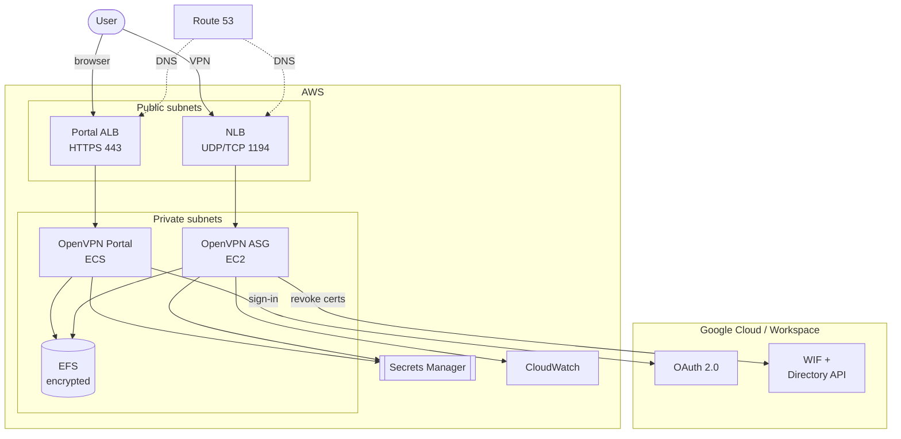

# Architecture

The module assembles several AWS components into a self-service VPN with Google authentication.

## Overview

## Components

### OpenVPN server (Auto Scaling group)

- Ubuntu EC2 instances (default `c6in.large`, compute-optimized for encryption workloads) in the
  **private** backend subnets.
- Managed by an Auto Scaling group with target-tracking policies on **CPU** and **network
  bandwidth**, so the fleet scales when either dimension saturates.
- A 10-minute (600s) health-check grace period lets new instances mount EFS and initialize OpenVPN
  before health checks apply.
- Bootstrapped via cloud-init (`infrahouse/cloud-init/aws`); configuration is rendered into Puppet.

### Network Load Balancer

- Sits in the **public** subnets and forwards OpenVPN traffic on port `1194` to the ASG target
  group.
- Provides a stable DNS endpoint (`vpn_server_fqdn`) for clients via a Route 53 CNAME.

### OpenVPN Portal (ECS service)

- A Flask application (`public.ecr.aws/infrahouse/openvpn-portal`) run as an ECS service through the
  `infrahouse/ecs/aws` module, fronted by its own **Application Load Balancer** on HTTPS.
- Handles **Google OAuth** sign-in, validates the user's domain, and serves a per-user `.ovpn`
  profile.
- The ALB **access-log bucket** is replicated to `replication_region` for audit/DR compliance.

### EFS (shared configuration)

- An **encrypted** EFS file system stores the OpenVPN CA, certificates, and server config.
- Mounted by both the OpenVPN instances and the portal tasks, so any instance can serve any user
  and config survives instance replacement.
- Protected by **AWS Backup** (enabled by default, 365-day retention).

### Secrets

All secrets use the `infrahouse/secret/aws` module:

- **CA passkey** — randomly generated, protects the OpenVPN certificate authority.
- **Flask secret key** — signs portal session cookies.
- **Google OAuth client** — placeholder you populate after the first deploy.

### Google (GCP + Workspace)

Google is an external component the module depends on in two independent ways
(see [Configuration → Google configuration](configuration.md#google-configuration)):

- **Portal OAuth** — users sign into the portal with Google; the portal validates
  their domain against `allowed_domains`. Backed by an OAuth 2.0 client whose
  secret lives in AWS Secrets Manager.
- **Keyless directory revocation (WIF)** — the OpenVPN instance federates its own
  AWS IAM role into GCP via Workload Identity Federation (**no service-account key
  at rest**), impersonates a Terraform-created directory-reader service account
  through domain-wide delegation, and reads Workspace suspension status to revoke
  the certificates of deactivated users. Terraform stands up the GCP side (SA,
  workload-identity pool + AWS provider, IAM bindings); the daily revocation sync
  itself runs on the instance (puppet-code + infrahouse-toolkit).

### Observability

- OpenVPN server logs ship to a **CloudWatch Log Group** (365-day retention by default).
- A **CPU utilization alarm** notifies `alarm_emails` (and an optional SNS topic).
- Portal logs flow to CloudWatch through the ECS module.

## Network flow

1. A user opens the portal URL; Route 53 resolves it to the portal ALB.
2. The portal authenticates the user against Google and checks their domain against
   `allowed_domains`.
3. The portal generates a profile from the CA on EFS and serves it.
4. The client connects to the NLB on `1194`; the NLB forwards to a healthy OpenVPN instance.
5. The instance pushes the configured `routes` so the client can reach private resources.

Separately, a **daily revocation sync** on each instance federates into GCP (keyless), reads which
Workspace users are deactivated, and revokes their certificates — regenerating the CRL so a revoked
user is refused at their next handshake.

## Multi-domain support

From version 4.0.0, the portal accepts users from multiple Google Workspace domains. The domain
derived from `zone_id` is always allowed; additional domains are listed in `allowed_domains`. Using
more than one domain requires marking the Google OAuth app **External**.
